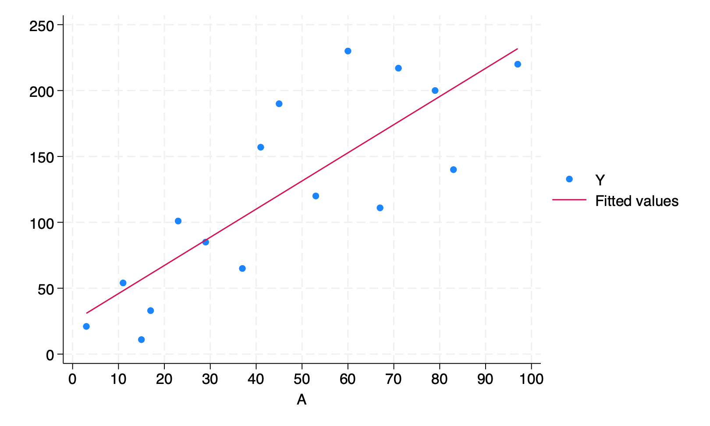

# (PART\*) Stata code{-}

# 11. Why model: Stata{-}

```{r, results='hide', message=FALSE, warning=FALSE}
library(Statamarkdown)
```

```
/***************************************************************
Stata code for Causal Inference: What If by Miguel Hernan & Jamie Robins
Date: 10/10/2019
Author: Eleanor Murray 
For errors contact: ejmurray@bu.edu
***************************************************************/
```

## Program 11.1

- Figures 11.1, 11.2, and 11.3
- Sample averages by treatment level

```{stata}
clear

**Figure 11.1**
*create the dataset*
input A Y
1 200
1 150
1 220
1 110
1 50
1 180
1 90
1 170
0 170
0 30
0 70
0 110
0 80
0 50
0 10
0 20
end

*Save the data*
qui save ./data/fig1, replace

*Build the scatterplot*
scatter Y A, ylab(0(50)250) xlab(0 1) xscale(range(-0.5 1.5))
qui gr export figs/stata-fig-11-1.png, replace

*Output the mean values for Y in each level of A*
bysort A: sum Y
```

```{r, echo=FALSE, out.width='75%'}
knitr::include_graphics("figs/stata-fig-11-1.png")
```

```{stata}
*Clear the workspace to be able to use a new dataset*
clear

**Figure 11.2**
input A Y
1 110
1 80
1 50
1 40
2 170
2 30
2 70
2 50
3 110
3 50
3 180
3 130
4 200
4 150
4 220
4 210
end

qui save ./data/fig2, replace

scatter Y A, ylab(0(50)250) xlab(0(1)4) xscale(range(0 4.5))
qui gr export figs/stata-fig-11-2.png, replace

bysort A: sum Y
```

```{r, echo=FALSE, out.width='75%'}
knitr::include_graphics("figs/stata-fig-11-2.png")
```

```{stata}
clear

**Figure 11.3**
input A Y
3   21	
11	54
17	33
23	101
29	85
37	65
41	157
53	120
67	111
79	200
83	140
97	220
60	230
71	217
15	11
45  190
end

qui save ./data/fig3, replace

scatter Y A, ylab(0(50)250) xlab(0(10)100) xscale(range(0 100))
qui gr export figs/stata-fig-11-3.png, replace
```

```{r, echo=FALSE, out.width='75%'}
knitr::include_graphics("figs/stata-fig-11-3.png")
```

## Program 11.2

- 2-parameter linear model
- Creates Figure 11.4, parameter estimates with 95% confidence intervals from Section 11.2, and parameter estimates with 95% confidence intervals from Section 11.3

```{stata}
**Section 11.2: parametric estimators**
*Reload data
use ./data/fig3, clear

*Plot the data*
scatter Y A, ylab(0(50)250) xlab(0(10)100) xscale(range(0 100))

*Fit the regression model*
regress Y A, noheader cformat(%5.2f)

*Output the estimated mean Y value when A = 90*
lincom _b[_cons] + 90*_b[A]

*Plot the data with the regression line: Fig 11.4*
scatter Y A, ylab(0(50)250) xlab(0(10)100) xscale(range(0 100)) || lfit Y A
qui gr export figs/stata-fig-11-4.png, replace
```

```{r, echo=FALSE, out.width='75%'}

```

```{stata}
**Section 11.3: non-parametric estimation*
* Reload the data
use ./data/fig1, clear

*Fit the regression model*
regress Y A, noheader cformat(%5.2f)

*E[Y|A=1]*
di 67.50 + 78.75
```

## Program 11.3

- 3-parameter linear model
- Creates Figure 11.5 and Parameter estimates for Section 11.4

```{stata}
* Reload the data
use ./data/fig3, clear

*Create the product term*
gen Asq = A*A

*Fit the regression model*
regress Y A Asq, noheader cformat(%5.2f)

*Output the estimated mean Y value when A = 90*
lincom _b[_cons] + 90*_b[A] + 90*90*_b[Asq]

*Plot the data with the regression line: Fig 11.5*
scatter Y A, ylab(0(50)250) xlab(0(10)100) xscale(range(0 100)) || qfit Y A
qui gr export figs/stata-fig-11-5.png, replace
```

```{r, echo=FALSE, out.width='75%'}
knitr::include_graphics("figs/stata-fig-11-5.png")
```
