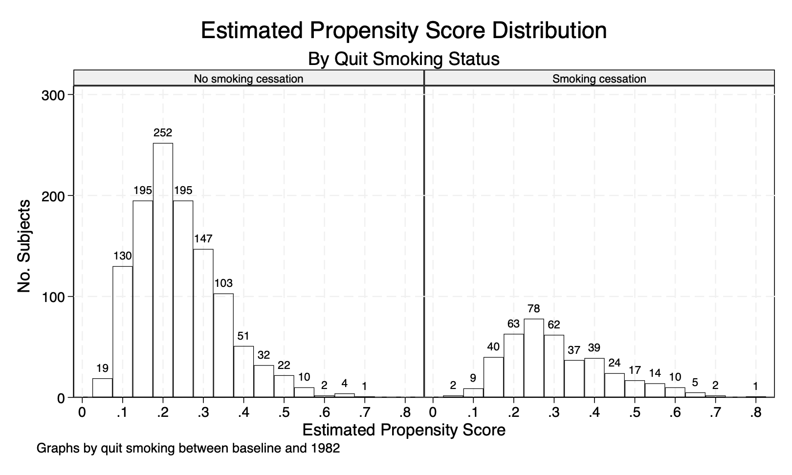

# 15. Outcome regression and propensity scores: Stata{-}

```{r, results='hide', message=FALSE, warning=FALSE}
library(Statamarkdown)
```

```
/***************************************************************
Stata code for Causal Inference: What If by Miguel Hernan & Jamie Robins
Date: 10/10/2019
Author: Eleanor Murray 
For errors contact: ejmurray@bu.edu
***************************************************************/
```

## Program 15.1

- Estimating the average causal effect within levels of confounders under the assumption of effect-measure modification by smoking intensity ONLY 
- Data from NHEFS
- Section 15.1

```{stata}
use ./data/nhefs-formatted, clear

/* Generate smoking intensity among smokers product term */
gen qsmkintensity = qsmk*smokeintensity

* Regression on covariates, allowing for some effect modfication
regress wt82_71 qsmk qsmkintensity ///
  c.smokeintensity##c.smokeintensity sex race c.age##c.age ///
  ib(last).education c.smokeyrs##c.smokeyrs ///
  ib(last).exercise ib(last).active c.wt71##c.wt71 

/* Display the estimated mean difference between quitting and 
  not quitting value when smoke intensity = 5 cigarettes/ day */
lincom 1*_b[qsmk] + 5*1*_b[qsmkintensity] 

/* Display the estimated mean difference between quitting and 
  not quitting value when smoke intensity = 40 cigarettes/ day */
lincom 1*_b[qsmk] + 40*1*_b[qsmkintensity]

/* Regression on covariates, with no product terms */
regress wt82_71 qsmk c.smokeintensity##c.smokeintensity ///
  sex race c.age##c.age ///
  ib(last).education c.smokeyrs##c.smokeyrs ///
  ib(last).exercise ib(last).active c.wt71##c.wt71 
```

## Prorgam 15.2

- Estimating and plotting the propensity score
- Data from NHEFS
- Section 15.2

```{stata}
use ./data/nhefs-formatted, clear

/*Fit a model for the exposure, quitting smoking*/
logit qsmk sex race c.age##c.age ib(last).education ///
  c.smokeintensity##c.smokeintensity ///
  c.smokeyrs##c.smokeyrs ib(last).exercise ib(last).active ///
  c.wt71##c.wt71 

/*Estimate the propensity score, P(Qsmk|Covariates)*/
predict ps, pr

/*Check the distribution of the propensity score*/
bys qsmk: summarize ps 

/*Return extreme values of propensity score:
  note, for Stata versions 15 and above, start by installing extremes*/
* ssc install extremes
extremes ps seqn
bys qsmk: extremes ps seqn

save ./data/nhefs-ps, replace

/*Plotting the estimated propensity score*/
histogram ps, width(0.05) start(0.025) ///
  frequency fcolor(none) lcolor(black) ///
  lpattern(solid) addlabel ///
  addlabopts(mlabcolor(black) mlabposition(12) ///
  mlabangle(zero)) ///
  ytitle(No. Subjects) ylabel(#4) ///
  xtitle(Estimated Propensity Score) xlabel(#15) ///
  by(, title(Estimated Propensity Score Distribution) ///
  subtitle(By Quit Smoking Status)) ///
  by(, legend(off)) ///
  by(qsmk, style(compact) colfirst) ///
  subtitle(, size(small) box bexpand)
qui gr export ./figs/stata-fig-15-2.png, replace
```

```{r, echo=FALSE, out.width="85%", fig.align='center'}

```

## Program 15.3

- Stratification and outcome regression using deciles of the propensity score
- Data from NHEFS
- Section 15.3
- Note: Stata decides borderline cutpoints differently from SAS, so, despite identically distributed propensity scores, the results of regression using deciles are not an exact match with the book.

```{stata}
use ./data/nhefs-ps, clear

/*Calculation of deciles of ps*/
xtile ps_dec = ps, nq(10)
by ps_dec, sort: summarize ps

/*Stratification on PS deciles, allowing for effect modification*/
/*Note: stata compares qsmk 0 vs qsmk 1, so the coefficients are reversed relative to the book*/
by ps_dec: ttest wt82_71, by(qsmk)

/*Regression on PS deciles, with no product terms*/
regress wt82_71 qsmk ib(last).ps_dec
```

## Program 15.4

- Standardization and outcome regression using the propensity score
- Data from NHEFS
- Section 15.3

```{stata}
use ./data/nhefs-formatted, clear

/*Estimate the propensity score*/
logit qsmk sex race c.age##c.age ib(last).education ///
  c.smokeintensity##c.smokeintensity ///
  c.smokeyrs##c.smokeyrs ib(last).exercise ///
  ib(last).active c.wt71##c.wt71 
predict ps, pr

/*Expand the dataset for standardization*/
expand 2, generate(interv)
expand 2 if interv == 0, generate(interv2)
replace interv = -1 if interv2 ==1
drop interv2 
tab interv
replace wt82_71 = . if interv != -1
replace qsmk = 0 if interv == 0
replace qsmk = 1 if interv == 1
by interv, sort: summarize qsmk

/*Regression on the propensity score, allowing for effect modification*/
regress wt82_71 qsmk##c.ps
predict predY, xb
by interv, sort: summarize predY

quietly summarize predY if(interv == -1)
matrix input observe = (-1,`r(mean)')
quietly summarize predY if(interv == 0)
matrix observe = (observe \0,`r(mean)')
quietly summarize predY if(interv == 1)
matrix observe = (observe \1,`r(mean)')
matrix observe = (observe \., observe[3,2]-observe[2,2]) 
matrix rownames observe = observed E(Y(a=0)) E(Y(a=1)) difference
matrix colnames observe = interv value
matrix list observe 

/*bootstrap program*/
drop if interv != -1
gen meanY_b =.
qui save ./data/nhefs_std, replace

capture program drop bootstdz

program define bootstdz, rclass
use ./data/nhefs_std, clear
preserve
bsample 
/*Create 2 new copies of the data. 
Set the outcome AND the exposure to missing in the copies*/
expand 2, generate(interv_b)
expand 2 if interv_b == 0, generate(interv2_b)
qui replace interv_b = -1 if interv2_b ==1
qui drop interv2_b
qui replace wt82_71 = . if interv_b != -1
qui replace qsmk = . if interv_b != -1

/*Fit the propensity score in the original data 
(where qsmk is not missing) and generate predictions for everyone*/
logit qsmk sex race c.age##c.age ib(last).education ///
  c.smokeintensity##c.smokeintensity ///
	c.smokeyrs##c.smokeyrs ib(last).exercise ib(last).active ///
	c.wt71##c.wt71 
predict ps_b, pr

/*Set the exposure to 0 for everyone in copy 0, 
and 1 to everyone for copy 1*/
qui replace qsmk = 0 if interv_b == 0
qui replace qsmk = 1 if interv_b == 1

/*Fit the outcome regression in the original data 
(where wt82_71 is not missing) and 
generate predictions for everyone*/
regress wt82_71 qsmk##c.ps
predict predY_b, xb

/*Summarize the predictions in each set of copies*/
summarize predY_b if interv_b == 0
return scalar boot_0 = r(mean)
summarize predY_b if interv_b == 1
return scalar boot_1 = r(mean)
return scalar boot_diff = return(boot_1) - return(boot_0)
qui drop meanY_b
restore
end

/*Then we use the `simulate` command to run the bootstraps 
as many times as we want.
Start with reps(10) to make sure your code runs, 
and then change to reps(1000) to generate your final CIs*/
simulate EY_a0=r(boot_0) EY_a1 = r(boot_1) ///
  difference = r(boot_diff), reps(500) seed(1): bootstdz /

matrix pe = observe[2..4, 2]'
matrix list pe
bstat, stat(pe) n(1629) 
estat bootstrap, p
```
