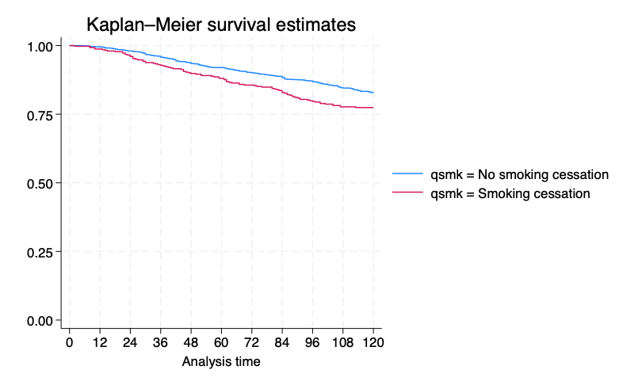
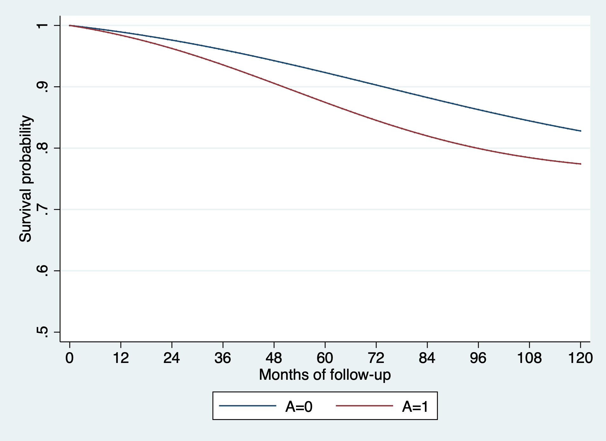
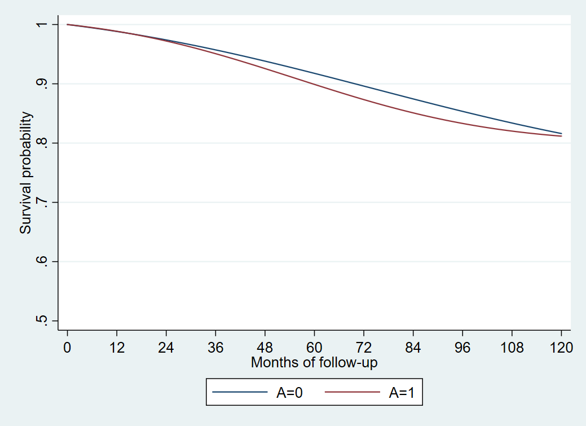
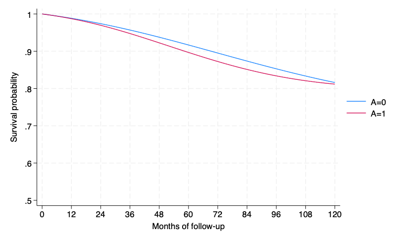

# 17. Causal survival analysis: Stata{-}

```{r, results='hide', message=FALSE, warning=FALSE}
library(Statamarkdown)
```

```
/***************************************************************
Stata code for Causal Inference: What If by Miguel Hernan & Jamie Robins
Date: 10/10/2019
Author: Eleanor Murray 
For errors contact: ejmurray@bu.edu
***************************************************************/
```

## Program 17.1

- Nonparametric estimation of survival curves
- Data from NHEFS
- Section 17.1

```{stata}
use ./data/nhefs-formatted, clear

/*Some preprocessing of the data*/
gen survtime = .
replace survtime = 120 if death == 0
replace survtime = (yrdth - 83)*12 + modth if death ==1
* yrdth ranges from 83 to 92*

tab death qsmk

/*Kaplan-Meier graph of observed survival over time, by quitting smoking*/
*For now, we use the stset function in Stata*
stset survtime, failure(death=1)
sts graph, by(qsmk) xlabel(0(12)120)
qui gr export ./figs/stata-fig-17-1.png, replace
```

```{r, echo=FALSE, out.width='75%'}

```

## Program 17.2

- Parametric estimation of survival curves via hazards model
- Data from NHEFS
- Section 17.1
- Generates Figure 17.4

```{stata}
/**Create person-month dataset for survival analyses**/

/* We want our new dataset to include 1 observation per person 
per month alive, starting at time = 0.
Individuals who survive to the end of follow-up will have 
119 time points
Individuals who die will have survtime - 1 time points*/

use ./data/nhefs-formatted, clear

gen survtime = .
replace survtime = 120 if death == 0
replace survtime = (yrdth - 83)*12 + modth if death ==1

*expand data to person-time*
gen time = 0
expand survtime if time == 0
bysort seqn: replace time = _n - 1

*Create event variable*
gen event = 0
replace event = 1 if time == survtime - 1 & death == 1
tab event

*Create time-squared variable for analyses*
gen timesq = time*time

*Save the dataset to your working directory for future use*
qui save ./data/nhefs_surv, replace

/**Hazard ratios**/
use ./data/nhefs_surv, clear

*Fit a pooled logistic hazards model *
logistic event qsmk qsmk#c.time qsmk#c.time#c.time ///
  c.time c.time#c.time 

/**Survival curves: run regression then do:**/

*Create a dataset with all time points under each treatment level*
*Re-expand data with rows for all timepoints*
drop if time != 0
expand 120 if time ==0 
bysort seqn: replace time = _n - 1	 
		
/*Create 2 copies of each subject, and set outcome to missing 
and treatment -- use only the newobs*/
expand 2 , generate(interv) 
replace qsmk = interv	

/*Generate predicted event and survival probabilities 
for each person each month in copies*/
predict pevent_k, pr
gen psurv_k = 1-pevent_k
keep seqn time qsmk interv psurv_k 

*Within copies, generate predicted survival over time*
*Remember, survival is the product of conditional survival probabilities in each interval*	
sort seqn interv time
gen _t = time + 1
gen psurv = psurv_k if _t ==1 		
bysort seqn interv: replace psurv = psurv_k*psurv[_t-1] if _t >1 

*Display 10-year standardized survival, under interventions*
*Note: since time starts at 0, month 119 is 10-year survival*
by interv, sort: summarize psurv if time == 119

*Graph of standardized survival over time, under interventions*
/*Note, we want our graph to start at 100% survival, 
so add an extra time point with P(surv) = 1*/
expand 2 if time ==0, generate(newtime)
replace psurv  = 1 if newtime == 1
gen time2 = 0 if newtime ==1
replace time2 = time + 1 if newtime == 0

/*Separate the survival probabilities to allow plotting by 
intervention on qsmk*/
separate psurv, by(interv)

*Plot the curves*
twoway (line psurv0 time2, sort) ///
  (line psurv1 time2, sort) if interv > -1 ///
  , ylabel(0.5(0.1)1.0) xlabel(0(12)120) ///
  ytitle("Survival probability") xtitle("Months of follow-up") ///
  legend(label(1 "A=0") label(2 "A=1"))
qui gr export ./figs/stata-fig-17-2.png, replace
```

```{r, echo=FALSE, out.width='75%'}

```

## Program 17.3

- Estimation of survival curves via IP weighted hazards model
- Data from NHEFS
- Section 17.4
- Generates Figure 17.6

```{stata}
use ./data/nhefs_surv, clear

keep seqn event qsmk time sex race age education ///
  smokeintensity smkintensity82_71 smokeyrs ///
  exercise active wt71
preserve 

*Estimate weights*
logit qsmk sex race c.age##c.age ib(last).education ///
  c.smokeintensity##c.smokeintensity ///
  c.smokeyrs##c.smokeyrs ib(last).exercise ///
  ib(last).active c.wt71##c.wt71 if time == 0
predict p_qsmk, pr

logit qsmk if time ==0 
predict num, pr
gen sw=num/p_qsmk if qsmk==1
replace sw=(1-num)/(1-p_qsmk) if qsmk==0
summarize sw

*IP weighted survival by smoking cessation*
logit event qsmk qsmk#c.time qsmk#c.time#c.time ///
  c.time c.time#c.time [pweight=sw] , cluster(seqn) 

*Create a dataset with all time points under each treatment level*
*Re-expand data with rows for all timepoints*
drop if time != 0
expand 120 if time ==0 
bysort seqn: replace time = _n - 1		 
		
/*Create 2 copies of each subject, and set outcome 
to missing and treatment -- use only the newobs*/
expand 2 , generate(interv) 
replace qsmk = interv	

/*Generate predicted event and survival probabilities 
for each person each month in copies*/
predict pevent_k, pr
gen psurv_k = 1-pevent_k
keep seqn time qsmk interv psurv_k 

*Within copies, generate predicted survival over time*
/*Remember, survival is the product of conditional survival
probabilities in each interval*/
sort seqn interv time
gen _t = time + 1
gen psurv = psurv_k if _t ==1 		
bysort seqn interv: replace psurv = psurv_k*psurv[_t-1] if _t >1 

*Display 10-year standardized survival, under interventions*
*Note: since time starts at 0, month 119 is 10-year survival*
by interv, sort: summarize psurv if time == 119

quietly summarize psurv if(interv==0 & time ==119)
matrix input observe = (0,`r(mean)')
quietly summarize psurv if(interv==1 & time ==119)
matrix observe = (observe \1,`r(mean)')
matrix observe = (observe \3, observe[2,2]-observe[1,2]) 
matrix list observe

*Graph of standardized survival over time, under interventions*
/*Note: since our outcome model has no covariates, 
we can plot psurv directly. 
If we had covariates we would need to stratify or average across the values*/
expand 2 if time ==0, generate(newtime)
replace psurv  = 1 if newtime == 1
gen time2 = 0 if newtime ==1
replace time2 = time + 1 if newtime == 0
separate psurv, by(interv) 
twoway (line psurv0 time2, sort) ///
  (line psurv1 time2, sort) if interv > -1 ///
  , ylabel(0.5(0.1)1.0) xlabel(0(12)120) ///
  ytitle("Survival probability") xtitle("Months of follow-up") ///
  legend(label(1 "A=0") label(2 "A=1"))
qui gr export ./figs/stata-fig-17-3.png, replace

*remove extra timepoint*
drop if newtime == 1
drop time2

restore

**Bootstraps**
qui save ./data/nhefs_std1 , replace
 
capture program drop bootipw_surv 

program define bootipw_surv , rclass
use ./data/nhefs_std1 , clear
preserve
bsample, cluster(seqn) idcluster(newseqn)  	
		
logit qsmk sex race c.age##c.age ib(last).education ///
  c.smokeintensity##c.smokeintensity ///
	c.smokeyrs##c.smokeyrs ib(last).exercise ib(last).active ///
	c.wt71##c.wt71 if time == 0
predict p_qsmk, pr

logit qsmk if time ==0 
predict num, pr

gen sw=num/p_qsmk if qsmk==1
replace sw=(1-num)/(1-p_qsmk) if qsmk==0

logit event qsmk qsmk#c.time qsmk#c.time#c.time ///
  c.time c.time#c.time [pweight=sw], cluster(newseqn) 
	
drop if time != 0
expand 120 if time ==0 
bysort newseqn: replace time = _n - 1		 
expand 2 , generate(interv_b) 
replace qsmk = interv_b	
		
predict pevent_k, pr
gen psurv_k = 1-pevent_k
keep newseqn time qsmk interv_b psurv_k 

sort newseqn interv_b time
gen _t = time + 1
gen psurv = psurv_k if _t ==1 		
bysort newseqn interv_b: ///
  replace psurv = psurv_k*psurv[_t-1] if _t >1 
drop if time != 119
bysort interv_b: egen meanS_b = mean(psurv)
keep newseqn qsmk  meanS_b 
drop if newseqn != 1  /* only need one pair */
	
drop newseqn 		
		
return scalar boot_0 = meanS_b[1]
return scalar boot_1 = meanS_b[2]
return scalar  boot_diff = return(boot_1) - return(boot_0)
restore
end		

set rmsg on
simulate PrY_a0 = r(boot_0) PrY_a1 = r(boot_1) ///
  difference=r(boot_diff), reps(10) seed(1): bootipw_surv
set rmsg off 
 
matrix pe = observe[1..3, 2]'
bstat, stat(pe) n(1629)
```

```{r, echo=FALSE, out.width='75%'}

```

## Program 17.4

- Estimating of survival curves via g-formula
- Data from NHEFS
- Section 17.5
- Generates Figure 17.7

```{stata}
use ./data/nhefs_surv, clear

keep seqn event qsmk time sex race age education ///
  smokeintensity smkintensity82_71  smokeyrs exercise ///
  active wt71 
preserve
 
quietly logistic event qsmk qsmk#c.time ///
  qsmk#c.time#c.time time c.time#c.time  ///
	sex race c.age##c.age ib(last).education ///
	c.smokeintensity##c.smokeintensity ///
	c.smokeyrs##c.smokeyrs ib(last).exercise ib(last).active ///
	c.wt71##c.wt71 , cluster(seqn) 
			
drop if time != 0
expand 120 if time ==0 
bysort seqn: replace time = _n - 1		 		
expand 2 , generate(interv) 
replace qsmk = interv 		 
predict pevent_k, pr
gen psurv_k = 1-pevent_k
keep seqn  time qsmk interv psurv_k 		       	
sort seqn interv time
gen _t = time + 1
gen psurv = psurv_k if _t ==1 		
bysort seqn interv: replace psurv = psurv_k*psurv[_t-1] if _t >1 
by interv, sort: summarize psurv if time == 119

keep qsmk interv psurv time   
		
bysort interv : egen meanS = mean(psurv) if time == 119
by interv: summarize meanS

quietly summarize meanS if(qsmk==0  & time ==119)
matrix input observe = ( 0,`r(mean)')
quietly summarize meanS if(qsmk==1  & time ==119)
matrix observe = (observe \1,`r(mean)')
matrix observe = (observe \2, observe[2,2]-observe[1,2]) 
*Add some row/column descriptions and print results to screen*
matrix rownames observe =  P(Y(a=0)=1) P(Y(a=1)=1) difference
matrix colnames observe = interv survival

*Graph standardized survival over time, under interventions*
/*Note: unlike in Program 17.3, we now have covariates 
so we first need to average survival across strata*/
bysort interv time : egen meanS_t = mean(psurv)

*Now we can continue with the graph*
expand 2 if time ==0, generate(newtime)
replace meanS_t  = 1 if newtime == 1
gen time2 = 0 if newtime ==1
replace time2 = time + 1 if newtime == 0
separate meanS_t, by(interv) 

twoway (line meanS_t0 time2, sort) ///
  (line meanS_t1 time2, sort) ///
  , ylabel(0.5(0.1)1.0) xlabel(0(12)120) ///
  ytitle("Survival probability") xtitle("Months of follow-up") ///
  legend(label(1 "A=0") label(2 "A=1"))
gr export ./figs/stata-fig-17-4.png, replace

*remove extra timepoint*
drop if newtime == 1

restore

*Bootstraps*
qui save ./data/nhefs_std2 , replace
 
capture program drop bootstdz_surv

program define bootstdz_surv , rclass
use ./data/nhefs_std2 , clear
preserve

bsample, cluster(seqn) idcluster(newseqn)  		
logistic event qsmk qsmk#c.time qsmk#c.time#c.time ///
  time c.time#c.time ///
	sex race c.age##c.age ib(last).education ///
	c.smokeintensity##c.smokeintensity c.smkintensity82_71 ///
	c.smokeyrs##c.smokeyrs ib(last).exercise ib(last).active ///
	c.wt71##c.wt71 
drop if time != 0	
/*only predict on new version of data */
expand 120 if time ==0 
bysort newseqn: replace time = _n - 1		 		
expand 2 , generate(interv_b) 
replace qsmk = interv_b 		 
predict pevent_k, pr
gen psurv_k = 1-pevent_k
keep newseqn  time qsmk psurv_k 		       	
sort newseqn qsmk time
gen _t = time + 1
gen psurv = psurv_k if _t ==1 	
bysort newseqn  qsmk: replace psurv = psurv_k*psurv[_t-1] if _t >1 
drop  if time != 119   /* keep only last observation */
keep newseqn qsmk psurv    
/* if time is in data for complete graph add time to bysort */	
bysort qsmk  : egen meanS_b = mean(psurv)
keep newseqn qsmk  meanS_b 
drop if newseqn != 1  /* only need one pair */
drop newseqn 		
	
return scalar boot_0 = meanS_b[1]
return scalar boot_1 = meanS_b[2]
return scalar boot_diff = return(boot_1) - return(boot_0)
restore
end

set rmsg on
simulate PrY_a0 = r(boot_0) PrY_a1 = r(boot_1) ///
  difference=r(boot_diff), reps(10) seed(1): bootstdz_surv
set rmsg off 
 
matrix pe = observe[1..3, 2]'
bstat, stat(pe) n(1629)
```

```{r, echo=FALSE, out.width='75%'}

```
