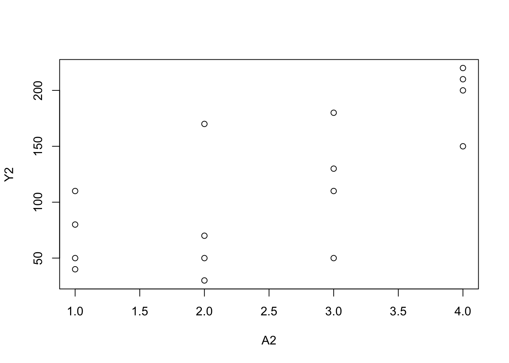

# (PART\*) R code{-}


# 11. Why model?{-}

## Program 11.1

- Sample averages by treatment level
- Data from Figures 11.1 and 11.2


``` r
A <- c(1, 1, 1, 1, 1, 1, 1, 1, 0, 0, 0, 0, 0, 0, 0, 0)
Y <- c(200, 150, 220, 110, 50, 180, 90, 170, 170, 30,
       70, 110, 80, 50, 10, 20)

plot(A, Y)
```


``` r
summary(Y[A == 0])
#>    Min. 1st Qu.  Median    Mean 3rd Qu.    Max. 
#>    10.0    27.5    60.0    67.5    87.5   170.0
summary(Y[A == 1])
#>    Min. 1st Qu.  Median    Mean 3rd Qu.    Max. 
#>    50.0   105.0   160.0   146.2   185.0   220.0

A2 <- c(1, 1, 1, 1, 2, 2, 2, 2, 3, 3, 3, 3, 4, 4, 4, 4)
Y2 <- c(110, 80, 50, 40, 170, 30, 70, 50, 110, 50, 180,
        130, 200, 150, 220, 210)

plot(A2, Y2)
```



``` r
summary(Y2[A2 == 1])
#>    Min. 1st Qu.  Median    Mean 3rd Qu.    Max. 
#>    40.0    47.5    65.0    70.0    87.5   110.0
summary(Y2[A2 == 2])
#>    Min. 1st Qu.  Median    Mean 3rd Qu.    Max. 
#>      30      45      60      80      95     170
summary(Y2[A2 == 3])
#>    Min. 1st Qu.  Median    Mean 3rd Qu.    Max. 
#>    50.0    95.0   120.0   117.5   142.5   180.0
summary(Y2[A2 == 4])
#>    Min. 1st Qu.  Median    Mean 3rd Qu.    Max. 
#>   150.0   187.5   205.0   195.0   212.5   220.0
```


## Program 11.2

- 2-parameter linear model
- Data from Figures 11.3 and 11.1


``` r
A3 <-
  c(3, 11, 17, 23, 29, 37, 41, 53, 67, 79, 83, 97, 60, 71, 15, 45)
Y3 <-
  c(21, 54, 33, 101, 85, 65, 157, 120, 111, 200, 140, 220, 230, 217,
    11, 190)

plot(Y3 ~ A3)
```


``` r

summary(glm(Y3 ~ A3))
#> 
#> Call:
#> glm(formula = Y3 ~ A3)
#> 
#> Coefficients:
#>             Estimate Std. Error t value Pr(>|t|)    
#> (Intercept)  24.5464    21.3300   1.151 0.269094    
#> A3            2.1372     0.3997   5.347 0.000103 ***
#> ---
#> Signif. codes:  0 '***' 0.001 '**' 0.01 '*' 0.05 '.' 0.1 ' ' 1
#> 
#> (Dispersion parameter for gaussian family taken to be 1944.109)
#> 
#>     Null deviance: 82800  on 15  degrees of freedom
#> Residual deviance: 27218  on 14  degrees of freedom
#> AIC: 170.43
#> 
#> Number of Fisher Scoring iterations: 2
predict(glm(Y3 ~ A3), data.frame(A3 = 90))
#>      1 
#> 216.89

summary(glm(Y ~ A))
#> 
#> Call:
#> glm(formula = Y ~ A)
#> 
#> Coefficients:
#>             Estimate Std. Error t value Pr(>|t|)   
#> (Intercept)    67.50      19.72   3.424  0.00412 **
#> A              78.75      27.88   2.824  0.01352 * 
#> ---
#> Signif. codes:  0 '***' 0.001 '**' 0.01 '*' 0.05 '.' 0.1 ' ' 1
#> 
#> (Dispersion parameter for gaussian family taken to be 3109.821)
#> 
#>     Null deviance: 68344  on 15  degrees of freedom
#> Residual deviance: 43538  on 14  degrees of freedom
#> AIC: 177.95
#> 
#> Number of Fisher Scoring iterations: 2
```

## Program 11.3

- 3-parameter linear model
- Data from Figure 11.3


``` r
Asq <- A3 * A3

mod3 <- glm(Y3 ~ A3 + Asq)
summary(mod3)
#> 
#> Call:
#> glm(formula = Y3 ~ A3 + Asq)
#> 
#> Coefficients:
#>             Estimate Std. Error t value Pr(>|t|)  
#> (Intercept) -7.40688   31.74777  -0.233   0.8192  
#> A3           4.10723    1.53088   2.683   0.0188 *
#> Asq         -0.02038    0.01532  -1.331   0.2062  
#> ---
#> Signif. codes:  0 '***' 0.001 '**' 0.01 '*' 0.05 '.' 0.1 ' ' 1
#> 
#> (Dispersion parameter for gaussian family taken to be 1842.697)
#> 
#>     Null deviance: 82800  on 15  degrees of freedom
#> Residual deviance: 23955  on 13  degrees of freedom
#> AIC: 170.39
#> 
#> Number of Fisher Scoring iterations: 2
predict(mod3, data.frame(cbind(A3 = 90, Asq = 8100)))
#>        1 
#> 197.1269
```
