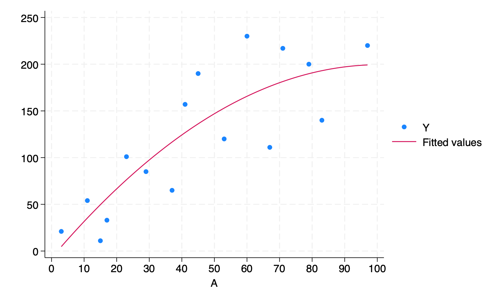

# (PART\*) Stata code{-}

# 11. Why model: Stata{-}


```r
library(Statamarkdown)
```


```stata
do dependency
```

```
checking extremes consistency and verifying not already installed...
all files already exist and are up to date.

checking tomata consistency and verifying not already installed...
all files already exist and are up to date.

end of do-file
```

```
/***************************************************************
Stata code for Causal Inference: What If by Miguel Hernan & Jamie Robins
Date: 10/10/2019
Author: Eleanor Murray 
For errors contact: ejmurray@bu.edu
***************************************************************/
```

## Program 11.1

- Figures 11.1, 11.2, and 11.3
- Sample averages by treatment level


```stata
clear

**Figure 11.1**
*create the dataset*
input A Y
1 200
1 150
1 220
1 110
1 50
1 180
1 90
1 170
0 170
0 30
0 70
0 110
0 80
0 50
0 10
0 20
end

*Save the data*
qui save ./data/fig1, replace

*Build the scatterplot*
scatter Y A, ylab(0(50)250) xlab(0 1) xscale(range(-0.5 1.5))
qui gr export figs/stata-fig-11-1.png, replace

*Output the mean values for Y in each level of A*
bysort A: sum Y
```

```
             A          Y
  1. 1 200
  2. 1 150
  3. 1 220
  4. 1 110
  5. 1 50
  6. 1 180
  7. 1 90
  8. 1 170
  9. 0 170
 10. 0 30
 11. 0 70
 12. 0 110
 13. 0 80
 14. 0 50
 15. 0 10
 16. 0 20
 17. end


-------------------------------------------------------------------------------
-> A = 0

    Variable |        Obs        Mean    Std. Dev.       Min        Max
-------------+---------------------------------------------------------
           Y |          8        67.5    53.11712         10        170

-------------------------------------------------------------------------------
-> A = 1

    Variable |        Obs        Mean    Std. Dev.       Min        Max
-------------+---------------------------------------------------------
           Y |          8      146.25     58.2942         50        220
```


```stata
*Clear the workspace to be able to use a new dataset*
clear

**Figure 11.2**
input A Y
1 110
1 80
1 50
1 40
2 170
2 30
2 70
2 50
3 110
3 50
3 180
3 130
4 200
4 150
4 220
4 210
end

qui save ./data/fig2, replace

scatter Y A, ylab(0(50)250) xlab(0(1)4) xscale(range(0 4.5))
qui gr export figs/stata-fig-11-2.png, replace

bysort A: sum Y
```

```
             A          Y
  1. 1 110
  2. 1 80
  3. 1 50
  4. 1 40
  5. 2 170
  6. 2 30
  7. 2 70
  8. 2 50
  9. 3 110
 10. 3 50
 11. 3 180
 12. 3 130
 13. 4 200
 14. 4 150
 15. 4 220
 16. 4 210
 17. end


-------------------------------------------------------------------------------
-> A = 1

    Variable |        Obs        Mean    Std. Dev.       Min        Max
-------------+---------------------------------------------------------
           Y |          4          70    31.62278         40        110

-------------------------------------------------------------------------------
-> A = 2

    Variable |        Obs        Mean    Std. Dev.       Min        Max
-------------+---------------------------------------------------------
           Y |          4          80    62.18253         30        170

-------------------------------------------------------------------------------
-> A = 3

    Variable |        Obs        Mean    Std. Dev.       Min        Max
-------------+---------------------------------------------------------
           Y |          4       117.5    53.77422         50        180

-------------------------------------------------------------------------------
-> A = 4

    Variable |        Obs        Mean    Std. Dev.       Min        Max
-------------+---------------------------------------------------------
           Y |          4         195    31.09126        150        220
```


```stata
clear

**Figure 11.3**
input A Y
3   21	
11	54
17	33
23	101
29	85
37	65
41	157
53	120
67	111
79	200
83	140
97	220
60	230
71	217
15	11
45  190
end

qui save ./data/fig3, replace

scatter Y A, ylab(0(50)250) xlab(0(10)100) xscale(range(0 100))
qui gr export figs/stata-fig-11-3.png, replace
```

```
             A          Y
  1. 3   21  
  2. 11      54
  3. 17      33
  4. 23      101
  5. 29      85
  6. 37      65
  7. 41      157
  8. 53      120
  9. 67      111
 10. 79      200
 11. 83      140
 12. 97      220
 13. 60      230
 14. 71      217
 15. 15      11
 16. 45  190
 17. end

```


## Program 11.2

- 2-parameter linear model
- Creates Figure 11.4, parameter estimates with 95% confidence intervals from Section 11.2, and parameter estimates with 95% confidence intervals from Section 11.3


```stata
**Section 11.2: parametric estimators**
*Reload data
use ./data/fig3, clear

*Plot the data*
scatter Y A, ylab(0(50)250) xlab(0(10)100) xscale(range(0 100))

*Fit the regression model*
regress Y A, noheader cformat(%5.2f)

*Output the estimated mean Y value when A = 90*
lincom _b[_cons] + 90*_b[A]

*Plot the data with the regression line: Fig 11.4*
scatter Y A, ylab(0(50)250) xlab(0(10)100) xscale(range(0 100)) || lfit Y A
qui gr export figs/stata-fig-11-4.png, replace
```

```
           Y |      Coef.   Std. Err.      t    P>|t|     [95% Conf. Interval]
-------------+----------------------------------------------------------------
           A |       2.14       0.40     5.35   0.000         1.28        2.99
       _cons |      24.55      21.33     1.15   0.269       -21.20       70.29
------------------------------------------------------------------------------


 ( 1)  90*A + _cons = 0

------------------------------------------------------------------------------
           Y |      Coef.   Std. Err.      t    P>|t|     [95% Conf. Interval]
-------------+----------------------------------------------------------------
         (1) |     216.89    20.8614    10.40   0.000     172.1468    261.6333
------------------------------------------------------------------------------

```


```stata
**Section 11.3: non-parametric estimation*
* Reload the data
use ./data/fig1, clear

*Fit the regression model*
regress Y A, noheader cformat(%5.2f)

*E[Y|A=1]*
di 67.50 + 78.75
```

```
           Y |      Coef.   Std. Err.      t    P>|t|     [95% Conf. Interval]
-------------+----------------------------------------------------------------
           A |      78.75      27.88     2.82   0.014        18.95      138.55
       _cons |      67.50      19.72     3.42   0.004        25.21      109.79
------------------------------------------------------------------------------

146.25
```

## Program 11.3

- 3-parameter linear model
- Creates Figure 11.5 and Parameter estimates for Section 11.4


```stata
* Reload the data
use ./data/fig3, clear

*Create the product term*
gen Asq = A*A

*Fit the regression model*
regress Y A Asq, noheader cformat(%5.2f)

*Output the estimated mean Y value when A = 90*
lincom _b[_cons] + 90*_b[A] + 90*90*_b[Asq]

*Plot the data with the regression line: Fig 11.5*
scatter Y A, ylab(0(50)250) xlab(0(10)100) xscale(range(0 100)) || qfit Y A
qui gr export figs/stata-fig-11-5.png, replace
```

```
           Y |      Coef.   Std. Err.      t    P>|t|     [95% Conf. Interval]
-------------+----------------------------------------------------------------
           A |       4.11       1.53     2.68   0.019         0.80        7.41
         Asq |      -0.02       0.02    -1.33   0.206        -0.05        0.01
       _cons |      -7.41      31.75    -0.23   0.819       -75.99       61.18
------------------------------------------------------------------------------


 ( 1)  90*A + 8100*Asq + _cons = 0

------------------------------------------------------------------------------
           Y |      Coef.   Std. Err.      t    P>|t|     [95% Conf. Interval]
-------------+----------------------------------------------------------------
         (1) |   197.1269   25.16157     7.83   0.000     142.7687    251.4852
------------------------------------------------------------------------------

```


