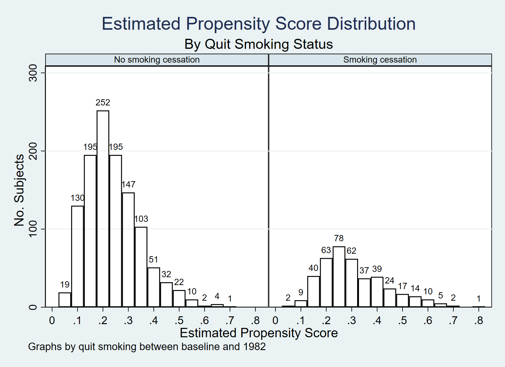

# 15. Outcome regression and propensity scores: Stata{-}


```r
library(Statamarkdown)
```

```
/***************************************************************
Stata code for Causal Inference: What If by Miguel Hernan & Jamie Robins
Date: 10/10/2019
Author: Eleanor Murray 
For errors contact: ejmurray@bu.edu
***************************************************************/
```

## Program 15.1

- Estimating the average causal effect within levels of confounders under the assumption of effect-measure modification by smoking intensity ONLY 
- Data from NHEFS
- Section 15.1


```stata
use ./data/nhefs-formatted, clear

/* Generate smoking intensity among smokers product term */
gen qsmkintensity = qsmk*smokeintensity

* Regression on covariates, allowing for some effect modfication
regress wt82_71 qsmk qsmkintensity ///
  c.smokeintensity##c.smokeintensity sex race c.age##c.age ///
  ib(last).education c.smokeyrs##c.smokeyrs ///
  ib(last).exercise ib(last).active c.wt71##c.wt71 

/* Display the estimated mean difference between quitting and 
  not quitting value when smoke intensity = 5 cigarettes/ day */
lincom 1*_b[qsmk] + 5*1*_b[qsmkintensity] 

/* Display the estimated mean difference between quitting and 
  not quitting value when smoke intensity = 40 cigarettes/ day */
lincom 1*_b[qsmk] + 40*1*_b[qsmkintensity]

/* Regression on covariates, with no product terms */
regress wt82_71 qsmk c.smokeintensity##c.smokeintensity ///
  sex race c.age##c.age ///
  ib(last).education c.smokeyrs##c.smokeyrs ///
  ib(last).exercise ib(last).active c.wt71##c.wt71 
```

```
      Source |       SS           df       MS      Number of obs   =     1,566
-------------+----------------------------------   F(20, 1545)     =     13.45
       Model |   14412.558        20    720.6279   Prob > F        =    0.0000
    Residual |  82763.0286     1,545  53.5683033   R-squared       =    0.1483
-------------+----------------------------------   Adj R-squared   =    0.1373
       Total |  97175.5866     1,565  62.0930266   Root MSE        =     7.319

---------------------------------------------------------------------------------------
              wt82_71 | Coefficient  Std. err.      t    P>|t|     [95% conf. interval]
----------------------+----------------------------------------------------------------
                 qsmk |   2.559594   .8091486     3.16   0.002     .9724486     4.14674
        qsmkintensity |   .0466628   .0351448     1.33   0.184    -.0222737    .1155993
       smokeintensity |   .0491365   .0517254     0.95   0.342     -.052323    .1505959
                      |
     c.smokeintensity#|
     c.smokeintensity |  -.0009907    .000938    -1.06   0.291    -.0028306    .0008493
                      |
                  sex |  -1.430272   .4689576    -3.05   0.002    -2.350132   -.5104111
                 race |   .5601096   .5818888     0.96   0.336    -.5812656    1.701485
                  age |   .3596353   .1633188     2.20   0.028     .0392854    .6799851
                      |
          c.age#c.age |   -.006101   .0017261    -3.53   0.000    -.0094868   -.0027151
                      |
            education |
                   1  |    .194977   .7413692     0.26   0.793    -1.259219    1.649173
                   2  |   .9854211   .7012116     1.41   0.160     -.390006    2.360848
                   3  |   .7512894   .6339153     1.19   0.236    -.4921358    1.994715
                   4  |   1.686547   .8716593     1.93   0.053    -.0232138    3.396307
                      |
             smokeyrs |   .1343686   .0917122     1.47   0.143     -.045525    .3142621
                      |
c.smokeyrs#c.smokeyrs |  -.0018664   .0015437    -1.21   0.227    -.0048944    .0011616
                      |
             exercise |
                   0  |  -.3539128   .5588587    -0.63   0.527    -1.450114    .7422889
                   1  |  -.0579374   .4316468    -0.13   0.893     -.904613    .7887381
                      |
               active |
                   0  |   .2613779   .6845577     0.38   0.703    -1.081382    1.604138
                   1  |  -.6861916   .6739131    -1.02   0.309    -2.008073    .6356894
                      |
                 wt71 |   .0455018   .0833709     0.55   0.585    -.1180303    .2090339
                      |
        c.wt71#c.wt71 |  -.0009653   .0005247    -1.84   0.066    -.0019945    .0000639
                      |
                _cons |  -1.690608   4.388883    -0.39   0.700     -10.2994    6.918188
---------------------------------------------------------------------------------------


 ( 1)  qsmk + 5*qsmkintensity = 0

------------------------------------------------------------------------------
     wt82_71 | Coefficient  Std. err.      t    P>|t|     [95% conf. interval]
-------------+----------------------------------------------------------------
         (1) |   2.792908   .6682596     4.18   0.000     1.482117      4.1037
------------------------------------------------------------------------------


 ( 1)  qsmk + 40*qsmkintensity = 0

------------------------------------------------------------------------------
     wt82_71 | Coefficient  Std. err.      t    P>|t|     [95% conf. interval]
-------------+----------------------------------------------------------------
         (1) |   4.426108   .8477818     5.22   0.000     2.763183    6.089032
------------------------------------------------------------------------------

      Source |       SS           df       MS      Number of obs   =     1,566
-------------+----------------------------------   F(19, 1546)     =     14.06
       Model |  14318.1239        19   753.58547   Prob > F        =    0.0000
    Residual |  82857.4627     1,546  53.5947365   R-squared       =    0.1473
-------------+----------------------------------   Adj R-squared   =    0.1369
       Total |  97175.5866     1,565  62.0930266   Root MSE        =    7.3208

---------------------------------------------------------------------------------------
              wt82_71 | Coefficient  Std. err.      t    P>|t|     [95% conf. interval]
----------------------+----------------------------------------------------------------
                 qsmk |   3.462622   .4384543     7.90   0.000     2.602594     4.32265
       smokeintensity |   .0651533   .0503115     1.29   0.196    -.0335327    .1638392
                      |
     c.smokeintensity#|
     c.smokeintensity |  -.0010468   .0009373    -1.12   0.264    -.0028853    .0007918
                      |
                  sex |   -1.46505    .468341    -3.13   0.002      -2.3837   -.5463989
                 race |   .5864117   .5816949     1.01   0.314    -.5545827    1.727406
                  age |   .3626624   .1633431     2.22   0.027     .0422649    .6830599
                      |
          c.age#c.age |  -.0061377   .0017263    -3.56   0.000    -.0095239   -.0027515
                      |
            education |
                   1  |   .1708264   .7413289     0.23   0.818     -1.28329    1.624943
                   2  |   .9893527   .7013784     1.41   0.159    -.3864007    2.365106
                   3  |   .7423268   .6340357     1.17   0.242     -.501334    1.985988
                   4  |   1.679344   .8718575     1.93   0.054    -.0308044    3.389492
                      |
             smokeyrs |   .1333931   .0917319     1.45   0.146    -.0465389    .3133252
                      |
c.smokeyrs#c.smokeyrs |   -.001827   .0015438    -1.18   0.237    -.0048552    .0012012
                      |
             exercise |
                   0  |  -.3628786   .5589557    -0.65   0.516     -1.45927    .7335129
                   1  |  -.0421962   .4315904    -0.10   0.922    -.8887606    .8043683
                      |
               active |
                   0  |   .2580374   .6847219     0.38   0.706    -1.085044    1.601119
                   1  |    -.68492   .6740787    -1.02   0.310    -2.007125    .6372851
                      |
                 wt71 |   .0373642   .0831658     0.45   0.653    -.1257655     .200494
                      |
        c.wt71#c.wt71 |  -.0009158   .0005235    -1.75   0.080    -.0019427    .0001111
                      |
                _cons |  -1.724603   4.389891    -0.39   0.694    -10.33537    6.886166
---------------------------------------------------------------------------------------
```

## Prorgam 15.2

- Estimating and plotting the propensity score
- Data from NHEFS
- Section 15.2


```stata
use ./data/nhefs-formatted, clear

/*Fit a model for the exposure, quitting smoking*/
logit qsmk sex race c.age##c.age ib(last).education ///
  c.smokeintensity##c.smokeintensity ///
  c.smokeyrs##c.smokeyrs ib(last).exercise ib(last).active ///
  c.wt71##c.wt71 

/*Estimate the propensity score, P(Qsmk|Covariates)*/
predict ps, pr

/*Check the distribution of the propensity score*/
bys qsmk: summarize ps 

/*Return extreme values of propensity score:
  note, for Stata versions 15 and above, start by installing extremes*/
* ssc install extremes
extremes ps seqn
bys qsmk: extremes ps seqn

save ./data/nhefs-ps, replace

/*Plotting the estimated propensity score*/
histogram ps, width(0.05) start(0.025) ///
  frequency fcolor(none) lcolor(black) ///
  lpattern(solid) addlabel ///
  addlabopts(mlabcolor(black) mlabposition(12) ///
  mlabangle(zero)) ///
  ytitle(No. Subjects) ylabel(#4) ///
  xtitle(Estimated Propensity Score) xlabel(#15) ///
  by(, title(Estimated Propensity Score Distribution) ///
  subtitle(By Quit Smoking Status)) ///
  by(, legend(off)) ///
  by(qsmk, style(compact) colfirst) ///
  subtitle(, size(small) box bexpand)
qui gr export ./figs/stata-fig-15-2.png, replace
```

```
Iteration 0:   log likelihood = -893.02712  
Iteration 1:   log likelihood = -839.70016  
Iteration 2:   log likelihood = -838.45045  
Iteration 3:   log likelihood = -838.44842  
Iteration 4:   log likelihood = -838.44842  

Logistic regression                                     Number of obs =  1,566
                                                        LR chi2(18)   = 109.16
                                                        Prob > chi2   = 0.0000
Log likelihood = -838.44842                             Pseudo R2     = 0.0611

---------------------------------------------------------------------------------------
                 qsmk | Coefficient  Std. err.      z    P>|z|     [95% conf. interval]
----------------------+----------------------------------------------------------------
                  sex |  -.5274782   .1540497    -3.42   0.001      -.82941   -.2255463
                 race |  -.8392636   .2100668    -4.00   0.000    -1.250987   -.4275404
                  age |   .1212052   .0512663     2.36   0.018     .0207251    .2216853
                      |
          c.age#c.age |  -.0008246   .0005361    -1.54   0.124    -.0018753    .0002262
                      |
            education |
                   1  |  -.4759606   .2262238    -2.10   0.035    -.9193511   -.0325701
                   2  |  -.5047361    .217597    -2.32   0.020    -.9312184   -.0782538
                   3  |  -.3895288   .1914353    -2.03   0.042    -.7647351   -.0143226
                   4  |  -.4123596   .2772868    -1.49   0.137    -.9558318    .1311126
                      |
       smokeintensity |  -.0772704   .0152499    -5.07   0.000    -.1071596   -.0473812
                      |
     c.smokeintensity#|
     c.smokeintensity |   .0010451   .0002866     3.65   0.000     .0004835    .0016068
                      |
             smokeyrs |  -.0735966   .0277775    -2.65   0.008    -.1280395   -.0191538
                      |
c.smokeyrs#c.smokeyrs |   .0008441   .0004632     1.82   0.068    -.0000637    .0017519
                      |
             exercise |
                   0  |   -.395704   .1872401    -2.11   0.035    -.7626878   -.0287201
                   1  |  -.0408635   .1382674    -0.30   0.768    -.3118627    .2301357
                      |
               active |
                   0  |   -.176784   .2149721    -0.82   0.411    -.5981215    .2445535
                   1  |  -.1448395   .2111472    -0.69   0.493    -.5586806    .2690015
                      |
                 wt71 |  -.0152357   .0263161    -0.58   0.563    -.0668144     .036343
                      |
        c.wt71#c.wt71 |   .0001352   .0001632     0.83   0.407    -.0001846     .000455
                      |
                _cons |   -1.19407   1.398493    -0.85   0.393    -3.935066    1.546925
---------------------------------------------------------------------------------------


---------------------------------------------------------------------------------------------
-> qsmk = No smoking cessation

    Variable |        Obs        Mean    Std. dev.       Min        Max
-------------+---------------------------------------------------------
          ps |      1,163    .2392928    .1056545   .0510008   .6814955

---------------------------------------------------------------------------------------------
-> qsmk = Smoking cessation

    Variable |        Obs        Mean    Std. dev.       Min        Max
-------------+---------------------------------------------------------
          ps |        403    .3094353    .1290642   .0598799   .7768887


  +--------------------------+
  |  obs:         ps    seqn |
  |--------------------------|
  |  979.   .0510008   22941 |
  |  945.   .0527126    1769 |
  | 1023.   .0558418   21140 |
  |  115.   .0558752    2522 |
  |  478.   .0567372   12639 |
  +--------------------------+

  +--------------------------+
  | 1173.   .6659576   22272 |
  | 1033.   .6814955   22773 |
  | 1551.   .7166381   14983 |
  | 1494.   .7200644   24817 |
  | 1303.   .7768887   24949 |
  +--------------------------+


---------------------------------------------------------------------------------------------
-> qsmk = No smoking cessation

  +--------------------------+
  |  obs:         ps    seqn |
  |--------------------------|
  |  979.   .0510008   22941 |
  |  945.   .0527126    1769 |
  | 1023.   .0558418   21140 |
  |  115.   .0558752    2522 |
  |  478.   .0567372   12639 |
  +--------------------------+

  +--------------------------+
  |  463.   .6337243   17096 |
  |  812.   .6345721   17768 |
  |  707.   .6440308   19147 |
  |  623.   .6566707   21983 |
  | 1033.   .6814955   22773 |
  +--------------------------+

---------------------------------------------------------------------------------------------
-> qsmk = Smoking cessation

  +--------------------------+
  |  obs:         ps    seqn |
  |--------------------------|
  | 1223.   .0598799    4289 |
  | 1283.   .0600822   23550 |
  | 1253.   .0806089   24306 |
  | 1467.   .0821677   22904 |
  | 1165.   .1021875   24584 |
  +--------------------------+

  +--------------------------+
  | 1399.    .635695   17738 |
  | 1173.   .6659576   22272 |
  | 1551.   .7166381   14983 |
  | 1494.   .7200644   24817 |
  | 1303.   .7768887   24949 |
  +--------------------------+

file ./data/nhefs-ps.dta saved

```



## Program 15.3

- Stratification and outcome regression using deciles of the propensity score
- Data from NHEFS
- Section 15.3
- Note: Stata decides borderline cutpoints differently from SAS, so, despite identically distributed propensity scores, the results of regression using deciles are not an exact match with the book.


```stata
use ./data/nhefs-ps, clear

/*Calculation of deciles of ps*/
xtile ps_dec = ps, nq(10)
by ps_dec, sort: summarize ps

/*Stratification on PS deciles, allowing for effect modification*/
/*Note: Stata compares qsmk 0 vs qsmk 1, so the coefficients are reversed 
relative to the book*/
by ps_dec: ttest wt82_71, by(qsmk)

/*Regression on PS deciles, with no product terms*/
regress wt82_71 qsmk ib(last).ps_dec
```

```
-> ps_dec = 1

    Variable |        Obs        Mean    Std. dev.       Min        Max
-------------+---------------------------------------------------------
          ps |        157    .0976251    .0185215   .0510008   .1240482

---------------------------------------------------------------------------------------------
-> ps_dec = 2

    Variable |        Obs        Mean    Std. dev.       Min        Max
-------------+---------------------------------------------------------
          ps |        157    .1430792    .0107751   .1241923   .1603558

---------------------------------------------------------------------------------------------
-> ps_dec = 3

    Variable |        Obs        Mean    Std. dev.       Min        Max
-------------+---------------------------------------------------------
          ps |        156    .1750423     .008773   .1606041   .1893271

---------------------------------------------------------------------------------------------
-> ps_dec = 4

    Variable |        Obs        Mean    Std. dev.       Min        Max
-------------+---------------------------------------------------------
          ps |        157    .2014066    .0062403    .189365   .2121815

---------------------------------------------------------------------------------------------
-> ps_dec = 5

    Variable |        Obs        Mean    Std. dev.       Min        Max
-------------+---------------------------------------------------------
          ps |        156    .2245376    .0073655   .2123068    .237184

---------------------------------------------------------------------------------------------
-> ps_dec = 6

    Variable |        Obs        Mean    Std. dev.       Min        Max
-------------+---------------------------------------------------------
          ps |        157    .2515298    .0078777   .2377578   .2655718

---------------------------------------------------------------------------------------------
-> ps_dec = 7

    Variable |        Obs        Mean    Std. dev.       Min        Max
-------------+---------------------------------------------------------
          ps |        157    .2827476    .0099986   .2655724   .2994968

---------------------------------------------------------------------------------------------
-> ps_dec = 8

    Variable |        Obs        Mean    Std. dev.       Min        Max
-------------+---------------------------------------------------------
          ps |        156    .3204104    .0125102   .2997581   .3438773

---------------------------------------------------------------------------------------------
-> ps_dec = 9

    Variable |        Obs        Mean    Std. dev.       Min        Max
-------------+---------------------------------------------------------
          ps |        157     .375637    .0221347   .3439862   .4174631

---------------------------------------------------------------------------------------------
-> ps_dec = 10

    Variable |        Obs        Mean    Std. dev.       Min        Max
-------------+---------------------------------------------------------
          ps |        156    .5026508    .0733494   .4176717   .7768887


---------------------------------------------------------------------------------------------
-> ps_dec = 1

Two-sample t test with equal variances
------------------------------------------------------------------------------
   Group |     Obs        Mean    Std. err.   Std. dev.   [95% conf. interval]
---------+--------------------------------------------------------------------
No smoki |     146     3.74236    .6531341    7.891849    2.451467    5.033253
 Smoking |      11    3.949703    2.332995    7.737668   -1.248533     9.14794
---------+--------------------------------------------------------------------
Combined |     157    3.756887    .6270464    7.856869     2.51829    4.995484
---------+--------------------------------------------------------------------
    diff |           -.2073431    2.464411               -5.075509    4.660822
------------------------------------------------------------------------------
    diff = mean(No smoki) - mean(Smoking)                         t =  -0.0841
H0: diff = 0                                     Degrees of freedom =      155

    Ha: diff < 0                 Ha: diff != 0                 Ha: diff > 0
 Pr(T < t) = 0.4665         Pr(|T| > |t|) = 0.9331          Pr(T > t) = 0.5335

---------------------------------------------------------------------------------------------
-> ps_dec = 2

Two-sample t test with equal variances
------------------------------------------------------------------------------
   Group |     Obs        Mean    Std. err.   Std. dev.   [95% conf. interval]
---------+--------------------------------------------------------------------
No smoki |     134    2.813019     .589056    6.818816    1.647889    3.978149
 Smoking |      23    7.726944    1.260784    6.046508    5.112237    10.34165
---------+--------------------------------------------------------------------
Combined |     157    3.532893    .5519826    6.916322    2.442569    4.623217
---------+--------------------------------------------------------------------
    diff |           -4.913925    1.515494               -7.907613   -1.920237
------------------------------------------------------------------------------
    diff = mean(No smoki) - mean(Smoking)                         t =  -3.2425
H0: diff = 0                                     Degrees of freedom =      155

    Ha: diff < 0                 Ha: diff != 0                 Ha: diff > 0
 Pr(T < t) = 0.0007         Pr(|T| > |t|) = 0.0015          Pr(T > t) = 0.9993

---------------------------------------------------------------------------------------------
-> ps_dec = 3

Two-sample t test with equal variances
------------------------------------------------------------------------------
   Group |     Obs        Mean    Std. err.   Std. dev.   [95% conf. interval]
---------+--------------------------------------------------------------------
No smoki |     128     3.25684    .5334655    6.035473    2.201209    4.312472
 Smoking |      28    7.954974    1.418184    7.504324    5.045101    10.86485
---------+--------------------------------------------------------------------
Combined |     156    4.100095    .5245749    6.551938    3.063857    5.136334
---------+--------------------------------------------------------------------
    diff |           -4.698134    1.318074               -7.301973   -2.094294
------------------------------------------------------------------------------
    diff = mean(No smoki) - mean(Smoking)                         t =  -3.5644
H0: diff = 0                                     Degrees of freedom =      154

    Ha: diff < 0                 Ha: diff != 0                 Ha: diff > 0
 Pr(T < t) = 0.0002         Pr(|T| > |t|) = 0.0005          Pr(T > t) = 0.9998

---------------------------------------------------------------------------------------------
-> ps_dec = 4

Two-sample t test with equal variances
------------------------------------------------------------------------------
   Group |     Obs        Mean    Std. err.   Std. dev.   [95% conf. interval]
---------+--------------------------------------------------------------------
No smoki |     121    3.393929    .5267602    5.794362    2.350981    4.436877
 Smoking |      36    5.676072    1.543143    9.258861    2.543324    8.808819
---------+--------------------------------------------------------------------
Combined |     157    3.917223    .5412091     6.78133    2.848179    4.986266
---------+--------------------------------------------------------------------
    diff |           -2.282143    1.278494               -4.807663    .2433778
------------------------------------------------------------------------------
    diff = mean(No smoki) - mean(Smoking)                         t =  -1.7850
H0: diff = 0                                     Degrees of freedom =      155

    Ha: diff < 0                 Ha: diff != 0                 Ha: diff > 0
 Pr(T < t) = 0.0381         Pr(|T| > |t|) = 0.0762          Pr(T > t) = 0.9619

---------------------------------------------------------------------------------------------
-> ps_dec = 5

Two-sample t test with equal variances
------------------------------------------------------------------------------
   Group |     Obs        Mean    Std. err.   Std. dev.   [95% conf. interval]
---------+--------------------------------------------------------------------
No smoki |     119    1.368438    .8042619    8.773461   -.2242199    2.961095
 Smoking |      37    5.195421    1.388723     8.44727    2.378961    8.011881
---------+--------------------------------------------------------------------
Combined |     156     2.27612    .7063778    8.822656    .8807499    3.671489
---------+--------------------------------------------------------------------
    diff |           -3.826983    1.637279               -7.061407    -.592559
------------------------------------------------------------------------------
    diff = mean(No smoki) - mean(Smoking)                         t =  -2.3374
H0: diff = 0                                     Degrees of freedom =      154

    Ha: diff < 0                 Ha: diff != 0                 Ha: diff > 0
 Pr(T < t) = 0.0104         Pr(|T| > |t|) = 0.0207          Pr(T > t) = 0.9896

---------------------------------------------------------------------------------------------
-> ps_dec = 6

Two-sample t test with equal variances
------------------------------------------------------------------------------
   Group |     Obs        Mean    Std. err.   Std. dev.   [95% conf. interval]
---------+--------------------------------------------------------------------
No smoki |     112     2.25564    .6850004    7.249362    .8982664    3.613014
 Smoking |      45    7.199088    1.724899    11.57097    3.722782    10.67539
---------+--------------------------------------------------------------------
Combined |     157    3.672552    .7146582    8.954642    2.260897    5.084207
---------+--------------------------------------------------------------------
    diff |           -4.943447    1.535024               -7.975714   -1.911181
------------------------------------------------------------------------------
    diff = mean(No smoki) - mean(Smoking)                         t =  -3.2204
H0: diff = 0                                     Degrees of freedom =      155

    Ha: diff < 0                 Ha: diff != 0                 Ha: diff > 0
 Pr(T < t) = 0.0008         Pr(|T| > |t|) = 0.0016          Pr(T > t) = 0.9992

---------------------------------------------------------------------------------------------
-> ps_dec = 7

Two-sample t test with equal variances
------------------------------------------------------------------------------
   Group |     Obs        Mean    Std. err.   Std. dev.   [95% conf. interval]
---------+--------------------------------------------------------------------
No smoki |     116    .7948483    .7916172    8.525978    -.773193     2.36289
 Smoking |      41    6.646091     1.00182    6.414778    4.621337    8.670844
---------+--------------------------------------------------------------------
Combined |     157     2.32288    .6714693    8.413486    .9965349    3.649225
---------+--------------------------------------------------------------------
    diff |           -5.851242     1.45977               -8.734853   -2.967632
------------------------------------------------------------------------------
    diff = mean(No smoki) - mean(Smoking)                         t =  -4.0083
H0: diff = 0                                     Degrees of freedom =      155

    Ha: diff < 0                 Ha: diff != 0                 Ha: diff > 0
 Pr(T < t) = 0.0000         Pr(|T| > |t|) = 0.0001          Pr(T > t) = 1.0000

---------------------------------------------------------------------------------------------
-> ps_dec = 8

Two-sample t test with equal variances
------------------------------------------------------------------------------
   Group |     Obs        Mean    Std. err.   Std. dev.   [95% conf. interval]
---------+--------------------------------------------------------------------
No smoki |     107    1.063848    .5840159    6.041107   -.0940204    2.221716
 Smoking |      49    3.116263    1.113479    7.794356    .8774626    5.355063
---------+--------------------------------------------------------------------
Combined |     156    1.708517    .5352016    6.684666    .6512864    2.765747
---------+--------------------------------------------------------------------
    diff |           -2.052415    1.144914                -4.31418    .2093492
------------------------------------------------------------------------------
    diff = mean(No smoki) - mean(Smoking)                         t =  -1.7926
H0: diff = 0                                     Degrees of freedom =      154

    Ha: diff < 0                 Ha: diff != 0                 Ha: diff > 0
 Pr(T < t) = 0.0375         Pr(|T| > |t|) = 0.0750          Pr(T > t) = 0.9625

---------------------------------------------------------------------------------------------
-> ps_dec = 9

Two-sample t test with equal variances
------------------------------------------------------------------------------
   Group |     Obs        Mean    Std. err.   Std. dev.   [95% conf. interval]
---------+--------------------------------------------------------------------
No smoki |     100   -.0292906    .7637396    7.637396   -1.544716    1.486134
 Smoking |      57    .9112647    .9969309    7.526663   -1.085828    2.908357
---------+--------------------------------------------------------------------
Combined |     157    .3121849    .6054898    7.586766   -.8838316    1.508201
---------+--------------------------------------------------------------------
    diff |           -.9405554     1.26092                -3.43136    1.550249
------------------------------------------------------------------------------
    diff = mean(No smoki) - mean(Smoking)                         t =  -0.7459
H0: diff = 0                                     Degrees of freedom =      155

    Ha: diff < 0                 Ha: diff != 0                 Ha: diff > 0
 Pr(T < t) = 0.2284         Pr(|T| > |t|) = 0.4568          Pr(T > t) = 0.7716

---------------------------------------------------------------------------------------------
-> ps_dec = 10

Two-sample t test with equal variances
------------------------------------------------------------------------------
   Group |     Obs        Mean    Std. err.   Std. dev.   [95% conf. interval]
---------+--------------------------------------------------------------------
No smoki |      80    -.768504    .9224756    8.250872   -2.604646    1.067638
 Smoking |      76     2.39532    1.053132    9.180992    .2973737    4.493267
---------+--------------------------------------------------------------------
Combined |     156    .7728463    .7071067    8.831759   -.6239631    2.169656
---------+--------------------------------------------------------------------
    diff |           -3.163824    1.396178               -5.921957    -.405692
------------------------------------------------------------------------------
    diff = mean(No smoki) - mean(Smoking)                         t =  -2.2661
H0: diff = 0                                     Degrees of freedom =      154

    Ha: diff < 0                 Ha: diff != 0                 Ha: diff > 0
 Pr(T < t) = 0.0124         Pr(|T| > |t|) = 0.0248          Pr(T > t) = 0.9876

      Source |       SS           df       MS      Number of obs   =     1,566
-------------+----------------------------------   F(10, 1555)     =      9.87
       Model |   5799.7817        10   579.97817   Prob > F        =    0.0000
    Residual |  91375.8049     1,555  58.7625755   R-squared       =    0.0597
-------------+----------------------------------   Adj R-squared   =    0.0536
       Total |  97175.5866     1,565  62.0930266   Root MSE        =    7.6657

------------------------------------------------------------------------------
     wt82_71 | Coefficient  Std. err.      t    P>|t|     [95% conf. interval]
-------------+----------------------------------------------------------------
        qsmk |   3.356927   .4580399     7.33   0.000     2.458486    4.255368
             |
      ps_dec |
          1  |   4.384269   .8873947     4.94   0.000     2.643652    6.124885
          2  |   3.903694   .8805212     4.43   0.000      2.17656    5.630828
          3  |    4.36015   .8793345     4.96   0.000     2.635343    6.084956
          4  |   4.010061   .8745966     4.59   0.000     2.294548    5.725575
          5  |   2.342505   .8754878     2.68   0.008     .6252438    4.059766
          6  |   3.572955   .8714389     4.10   0.000     1.863636    5.282275
          7  |    2.30881   .8727462     2.65   0.008     .5969261    4.020693
          8  |   1.516677   .8715796     1.74   0.082    -.1929182    3.226273
          9  |  -.0439923   .8684465    -0.05   0.960    -1.747442    1.659457
             |
       _cons |  -.8625798   .6530529    -1.32   0.187    -2.143537    .4183773
------------------------------------------------------------------------------
```

## Program 15.4

- Standardization and outcome regression using the propensity score
- Data from NHEFS
- Section 15.3


```stata
use ./data/nhefs-formatted, clear

/*Estimate the propensity score*/
logit qsmk sex race c.age##c.age ib(last).education ///
  c.smokeintensity##c.smokeintensity ///
  c.smokeyrs##c.smokeyrs ib(last).exercise ///
  ib(last).active c.wt71##c.wt71 
predict ps, pr

/*Expand the dataset for standardization*/
expand 2, generate(interv)
expand 2 if interv == 0, generate(interv2)
replace interv = -1 if interv2 ==1
drop interv2 
tab interv
replace wt82_71 = . if interv != -1
replace qsmk = 0 if interv == 0
replace qsmk = 1 if interv == 1
by interv, sort: summarize qsmk

/*Regression on the propensity score, allowing for effect modification*/
regress wt82_71 qsmk##c.ps
predict predY, xb
by interv, sort: summarize predY

quietly summarize predY if(interv == -1)
matrix input observe = (-1,`r(mean)')
quietly summarize predY if(interv == 0)
matrix observe = (observe \0,`r(mean)')
quietly summarize predY if(interv == 1)
matrix observe = (observe \1,`r(mean)')
matrix observe = (observe \., observe[3,2]-observe[2,2]) 
matrix rownames observe = observed E(Y(a=0)) E(Y(a=1)) difference
matrix colnames observe = interv value
matrix list observe 

/*bootstrap program*/
drop if interv != -1
gen meanY_b =.
qui save ./data/nhefs_std, replace

capture program drop bootstdz

program define bootstdz, rclass
use ./data/nhefs_std, clear
preserve
bsample 
/*Create 2 new copies of the data. 
Set the outcome AND the exposure to missing in the copies*/
expand 2, generate(interv_b)
expand 2 if interv_b == 0, generate(interv2_b)
qui replace interv_b = -1 if interv2_b ==1
qui drop interv2_b
qui replace wt82_71 = . if interv_b != -1
qui replace qsmk = . if interv_b != -1

/*Fit the propensity score in the original data 
(where qsmk is not missing) and generate predictions for everyone*/
logit qsmk sex race c.age##c.age ib(last).education ///
  c.smokeintensity##c.smokeintensity ///
	c.smokeyrs##c.smokeyrs ib(last).exercise ib(last).active ///
	c.wt71##c.wt71 
predict ps_b, pr

/*Set the exposure to 0 for everyone in copy 0, 
and 1 to everyone for copy 1*/
qui replace qsmk = 0 if interv_b == 0
qui replace qsmk = 1 if interv_b == 1

/*Fit the outcome regression in the original data 
(where wt82_71 is not missing) and 
generate predictions for everyone*/
regress wt82_71 qsmk##c.ps
predict predY_b, xb

/*Summarize the predictions in each set of copies*/
summarize predY_b if interv_b == 0
return scalar boot_0 = r(mean)
summarize predY_b if interv_b == 1
return scalar boot_1 = r(mean)
return scalar boot_diff = return(boot_1) - return(boot_0)
qui drop meanY_b
restore
end

/*Then we use the `simulate` command to run the bootstraps 
as many times as we want.
Start with reps(10) to make sure your code runs, 
and then change to reps(1000) to generate your final CIs*/
simulate EY_a0=r(boot_0) EY_a1 = r(boot_1) ///
  difference = r(boot_diff), reps(500) seed(1): bootstdz /

matrix pe = observe[2..4, 2]'
matrix list pe
bstat, stat(pe) n(1629) 
estat bootstrap, p
```

```
Iteration 0:   log likelihood = -893.02712  
Iteration 1:   log likelihood = -839.70016  
Iteration 2:   log likelihood = -838.45045  
Iteration 3:   log likelihood = -838.44842  
Iteration 4:   log likelihood = -838.44842  

Logistic regression                                     Number of obs =  1,566
                                                        LR chi2(18)   = 109.16
                                                        Prob > chi2   = 0.0000
Log likelihood = -838.44842                             Pseudo R2     = 0.0611

---------------------------------------------------------------------------------------
                 qsmk | Coefficient  Std. err.      z    P>|z|     [95% conf. interval]
----------------------+----------------------------------------------------------------
                  sex |  -.5274782   .1540497    -3.42   0.001      -.82941   -.2255463
                 race |  -.8392636   .2100668    -4.00   0.000    -1.250987   -.4275404
                  age |   .1212052   .0512663     2.36   0.018     .0207251    .2216853
                      |
          c.age#c.age |  -.0008246   .0005361    -1.54   0.124    -.0018753    .0002262
                      |
            education |
                   1  |  -.4759606   .2262238    -2.10   0.035    -.9193511   -.0325701
                   2  |  -.5047361    .217597    -2.32   0.020    -.9312184   -.0782538
                   3  |  -.3895288   .1914353    -2.03   0.042    -.7647351   -.0143226
                   4  |  -.4123596   .2772868    -1.49   0.137    -.9558318    .1311126
                      |
       smokeintensity |  -.0772704   .0152499    -5.07   0.000    -.1071596   -.0473812
                      |
     c.smokeintensity#|
     c.smokeintensity |   .0010451   .0002866     3.65   0.000     .0004835    .0016068
                      |
             smokeyrs |  -.0735966   .0277775    -2.65   0.008    -.1280395   -.0191538
                      |
c.smokeyrs#c.smokeyrs |   .0008441   .0004632     1.82   0.068    -.0000637    .0017519
                      |
             exercise |
                   0  |   -.395704   .1872401    -2.11   0.035    -.7626878   -.0287201
                   1  |  -.0408635   .1382674    -0.30   0.768    -.3118627    .2301357
                      |
               active |
                   0  |   -.176784   .2149721    -0.82   0.411    -.5981215    .2445535
                   1  |  -.1448395   .2111472    -0.69   0.493    -.5586806    .2690015
                      |
                 wt71 |  -.0152357   .0263161    -0.58   0.563    -.0668144     .036343
                      |
        c.wt71#c.wt71 |   .0001352   .0001632     0.83   0.407    -.0001846     .000455
                      |
                _cons |   -1.19407   1.398493    -0.85   0.393    -3.935066    1.546925
---------------------------------------------------------------------------------------


(1,566 observations created)

(1,566 observations created)

(1,566 real changes made)


  Expanded observation |
                  type |      Freq.     Percent        Cum.
-----------------------+-----------------------------------
                    -1 |      1,566       33.33       33.33
  Original observation |      1,566       33.33       66.67
Duplicated observation |      1,566       33.33      100.00
-----------------------+-----------------------------------
                 Total |      4,698      100.00

(3,132 real changes made, 3,132 to missing)

(403 real changes made)

(1,163 real changes made)


---------------------------------------------------------------------------------------------
-> interv = -1

    Variable |        Obs        Mean    Std. dev.       Min        Max
-------------+---------------------------------------------------------
        qsmk |      1,566    .2573436    .4373099          0          1

---------------------------------------------------------------------------------------------
-> interv = Original

    Variable |        Obs        Mean    Std. dev.       Min        Max
-------------+---------------------------------------------------------
        qsmk |      1,566           0           0          0          0

---------------------------------------------------------------------------------------------
-> interv = Duplicat

    Variable |        Obs        Mean    Std. dev.       Min        Max
-------------+---------------------------------------------------------
        qsmk |      1,566           1           0          1          1

      Source |       SS           df       MS      Number of obs   =     1,566
-------------+----------------------------------   F(3, 1562)      =     29.96
       Model |  5287.31428         3  1762.43809   Prob > F        =    0.0000
    Residual |  91888.2723     1,562   58.827319   R-squared       =    0.0544
-------------+----------------------------------   Adj R-squared   =    0.0526
       Total |  97175.5866     1,565  62.0930266   Root MSE        =    7.6699

------------------------------------------------------------------------------------
           wt82_71 | Coefficient  Std. err.      t    P>|t|     [95% conf. interval]
-------------------+----------------------------------------------------------------
              qsmk |
Smoking cessation  |   4.036457    1.13904     3.54   0.000      1.80225    6.270665
                ps |   -12.3319   2.129602    -5.79   0.000    -16.50908   -8.154716
                   |
         qsmk#c.ps |
Smoking cessation  |  -2.038829   3.649684    -0.56   0.576    -9.197625    5.119967
                   |
             _cons |   4.935432   .5570216     8.86   0.000     3.842843    6.028021
------------------------------------------------------------------------------------


---------------------------------------------------------------------------------------------
-> interv = -1

    Variable |        Obs        Mean    Std. dev.       Min        Max
-------------+---------------------------------------------------------
       predY |      1,566      2.6383    1.838063    -3.4687   8.111371

---------------------------------------------------------------------------------------------
-> interv = Original

    Variable |        Obs        Mean    Std. dev.       Min        Max
-------------+---------------------------------------------------------
       predY |      1,566    1.761898    1.433264  -4.645079   4.306496

---------------------------------------------------------------------------------------------
-> interv = Duplicat

    Variable |        Obs        Mean    Std. dev.       Min        Max
-------------+---------------------------------------------------------
       predY |      1,566    5.273676    1.670225  -2.192565   8.238971


observe[4,2]
               interv      value
  observed         -1  2.6382998
 E(Y(a=0))          0  1.7618979
 E(Y(a=1))          1  5.2736757
difference          .  3.5117778

(3,132 observations deleted)

(1,566 missing values generated)


 11. predict ps_b, pr
 12. 

      Command: bootstdz /
        EY_a0: r(boot_0)
        EY_a1: r(boot_1)
   difference: r(boot_diff)

Simulations (500)
----+--- 1 ---+--- 2 ---+--- 3 ---+--- 4 ---+--- 5 
..................................................    50
..................................................   100
..................................................   150
..................................................   200
..................................................   250
..................................................   300
..................................................   350
..................................................   400
..................................................   450
..................................................   500


pe[1,3]
        E(Y(a=0))   E(Y(a=1))  difference
value   1.7618979   5.2736757   3.5117778


Bootstrap results                                        Number of obs = 1,629
                                                         Replications  =   500

------------------------------------------------------------------------------
             |   Observed   Bootstrap                         Normal-based
             | coefficient  std. err.      z    P>|z|     [95% conf. interval]
-------------+----------------------------------------------------------------
       EY_a0 |   1.761898   .2255637     7.81   0.000     1.319801    2.203995
       EY_a1 |   5.273676   .4695378    11.23   0.000     4.353399    6.193953
  difference |   3.511778   .4970789     7.06   0.000     2.537521    4.486035
------------------------------------------------------------------------------


Bootstrap results                               Number of obs     =      1,629
                                                Replications      =        500

------------------------------------------------------------------------------
             |    Observed               Bootstrap
             | coefficient       Bias    std. err.  [95% conf. interval]
-------------+----------------------------------------------------------------
       EY_a0 |   1.7618979   .0026735   .22556365    1.269908   2.186845   (P)
       EY_a1 |   5.2736757  -.0049491   .46953779     4.34944   6.109205   (P)
  difference |   3.5117778  -.0076226   .49707894    2.466025   4.424034   (P)
------------------------------------------------------------------------------
Key: P: Percentile
```
