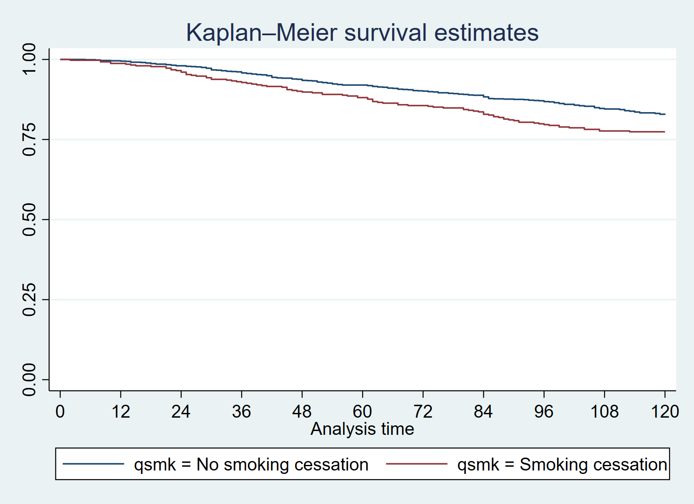
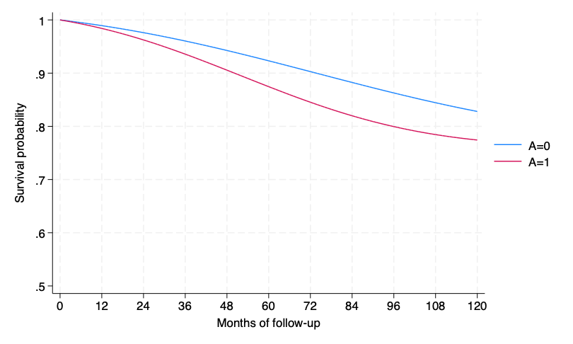
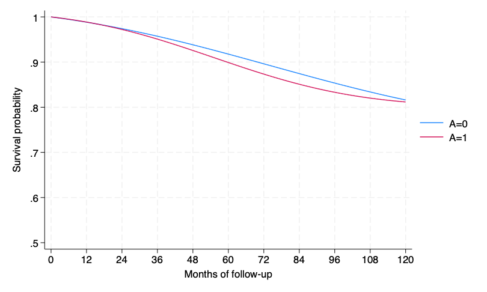
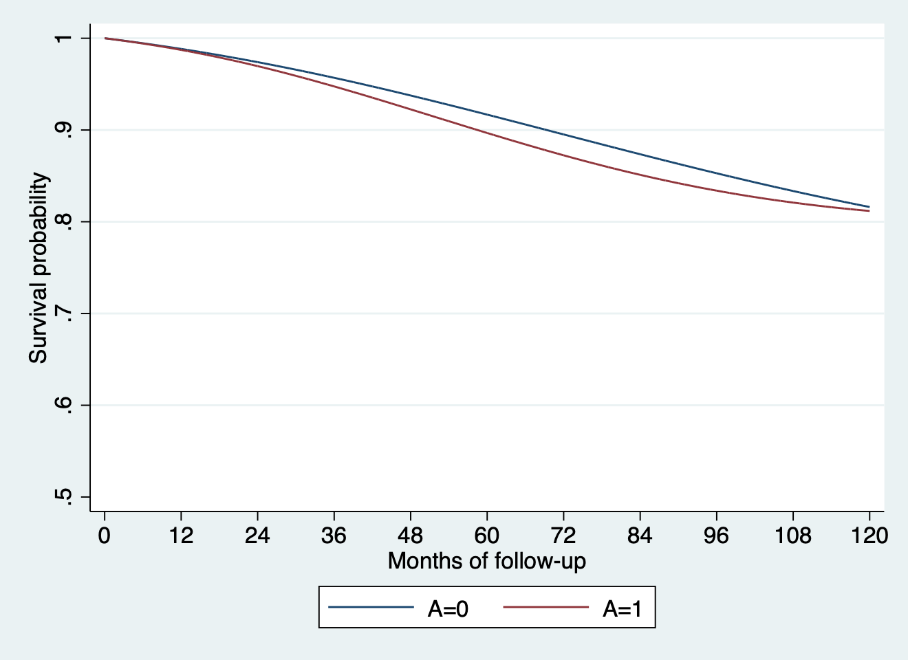

# 17. Causal survival analysis: Stata{-}


```r
library(Statamarkdown)
```

```
/***************************************************************
Stata code for Causal Inference: What If by Miguel Hernan & Jamie Robins
Date: 10/10/2019
Author: Eleanor Murray 
For errors contact: ejmurray@bu.edu
***************************************************************/
```

## Program 17.1

- Nonparametric estimation of survival curves
- Data from NHEFS
- Section 17.1


```stata
use ./data/nhefs-formatted, clear

/*Some preprocessing of the data*/
gen survtime = .
replace survtime = 120 if death == 0
replace survtime = (yrdth - 83)*12 + modth if death ==1
* yrdth ranges from 83 to 92*

tab death qsmk

/*Kaplan-Meier graph of observed survival over time, by quitting smoking*/
*For now, we use the stset function in Stata*
stset survtime, failure(death=1)
sts graph, by(qsmk) xlabel(0(12)120)
qui gr export ./figs/stata-fig-17-1.png, replace
```

```
(1,566 missing values generated)

(1,275 real changes made)

(291 real changes made)

     death |
   between | quit smoking between
  1983 and |   baseline and 1982
      1992 | No smokin  Smoking c |     Total
-----------+----------------------+----------
         0 |       963        312 |     1,275 
         1 |       200         91 |       291 
-----------+----------------------+----------
     Total |     1,163        403 |     1,566 

     failure event:  death == 1
obs. time interval:  (0, survtime]
 exit on or before:  failure

------------------------------------------------------------------------------
      1,566  total observations
          0  exclusions
------------------------------------------------------------------------------
      1,566  observations remaining, representing
        291  failures in single-record/single-failure data
    171,076  total analysis time at risk and under observation
                                                at risk from t =         0
                                     earliest observed entry t =         0
                                          last observed exit t =       120

         failure _d:  death == 1
   analysis time _t:  survtime
```



## Program 17.2

- Parametric estimation of survival curves via hazards model
- Data from NHEFS
- Section 17.1
- Generates Figure 17.4


```stata
/**Create person-month dataset for survival analyses**/

/* We want our new dataset to include 1 observation per person 
per month alive, starting at time = 0.
Individuals who survive to the end of follow-up will have 
119 time points
Individuals who die will have survtime - 1 time points*/

use ./data/nhefs-formatted, clear

gen survtime = .
replace survtime = 120 if death == 0
replace survtime = (yrdth - 83)*12 + modth if death ==1

*expand data to person-time*
gen time = 0
expand survtime if time == 0
bysort seqn: replace time = _n - 1

*Create event variable*
gen event = 0
replace event = 1 if time == survtime - 1 & death == 1
tab event

*Create time-squared variable for analyses*
gen timesq = time*time

*Save the dataset to your working directory for future use*
qui save ./data/nhefs_surv, replace

/**Hazard ratios**/
use ./data/nhefs_surv, clear

*Fit a pooled logistic hazards model *
logistic event qsmk qsmk#c.time qsmk#c.time#c.time ///
  c.time c.time#c.time 

/**Survival curves: run regression then do:**/

*Create a dataset with all time points under each treatment level*
*Re-expand data with rows for all timepoints*
drop if time != 0
expand 120 if time ==0 
bysort seqn: replace time = _n - 1	 
		
/*Create 2 copies of each subject, and set outcome to missing 
and treatment -- use only the newobs*/
expand 2 , generate(interv) 
replace qsmk = interv	

/*Generate predicted event and survival probabilities 
for each person each month in copies*/
predict pevent_k, pr
gen psurv_k = 1-pevent_k
keep seqn time qsmk interv psurv_k 

*Within copies, generate predicted survival over time*
*Remember, survival is the product of conditional survival probabilities in each interval*	
sort seqn interv time
gen _t = time + 1
gen psurv = psurv_k if _t ==1 		
bysort seqn interv: replace psurv = psurv_k*psurv[_t-1] if _t >1 

*Display 10-year standardized survival, under interventions*
*Note: since time starts at 0, month 119 is 10-year survival*
by interv, sort: summarize psurv if time == 119

*Graph of standardized survival over time, under interventions*
/*Note, we want our graph to start at 100% survival, 
so add an extra time point with P(surv) = 1*/
expand 2 if time ==0, generate(newtime)
replace psurv  = 1 if newtime == 1
gen time2 = 0 if newtime ==1
replace time2 = time + 1 if newtime == 0

/*Separate the survival probabilities to allow plotting by 
intervention on qsmk*/
separate psurv, by(interv)

*Plot the curves*
twoway (line psurv0 time2, sort) ///
  (line psurv1 time2, sort) if interv > -1 ///
  , ylabel(0.5(0.1)1.0) xlabel(0(12)120) ///
  ytitle("Survival probability") xtitle("Months of follow-up") ///
  legend(label(1 "A=0") label(2 "A=1"))
qui gr export ./figs/stata-fig-17-2.png, replace
```

```
(1,566 missing values generated)

(1,275 real changes made)

(291 real changes made)


(169,510 observations created)

(169,510 real changes made)


(291 real changes made)

      event |      Freq.     Percent        Cum.
------------+-----------------------------------
          0 |    170,785       99.83       99.83
          1 |        291        0.17      100.00
------------+-----------------------------------
      Total |    171,076      100.00


file ./data/nhefs_surv.dta cannot be modified or erased; likely cause is
    read-only directory or file
r(608);

end of do-file
r(608);
```



## Program 17.3

- Estimation of survival curves via IP weighted hazards model
- Data from NHEFS
- Section 17.4
- Generates Figure 17.6


```stata
use ./data/nhefs_surv, clear

keep seqn event qsmk time sex race age education ///
  smokeintensity smkintensity82_71 smokeyrs ///
  exercise active wt71
preserve 

*Estimate weights*
logit qsmk sex race c.age##c.age ib(last).education ///
  c.smokeintensity##c.smokeintensity ///
  c.smokeyrs##c.smokeyrs ib(last).exercise ///
  ib(last).active c.wt71##c.wt71 if time == 0
predict p_qsmk, pr

logit qsmk if time ==0 
predict num, pr
gen sw=num/p_qsmk if qsmk==1
replace sw=(1-num)/(1-p_qsmk) if qsmk==0
summarize sw

*IP weighted survival by smoking cessation*
logit event qsmk qsmk#c.time qsmk#c.time#c.time ///
  c.time c.time#c.time [pweight=sw] , cluster(seqn) 

*Create a dataset with all time points under each treatment level*
*Re-expand data with rows for all timepoints*
drop if time != 0
expand 120 if time ==0 
bysort seqn: replace time = _n - 1		 
		
/*Create 2 copies of each subject, and set outcome 
to missing and treatment -- use only the newobs*/
expand 2 , generate(interv) 
replace qsmk = interv	

/*Generate predicted event and survival probabilities 
for each person each month in copies*/
predict pevent_k, pr
gen psurv_k = 1-pevent_k
keep seqn time qsmk interv psurv_k 

*Within copies, generate predicted survival over time*
/*Remember, survival is the product of conditional survival
probabilities in each interval*/
sort seqn interv time
gen _t = time + 1
gen psurv = psurv_k if _t ==1 		
bysort seqn interv: replace psurv = psurv_k*psurv[_t-1] if _t >1 

*Display 10-year standardized survival, under interventions*
*Note: since time starts at 0, month 119 is 10-year survival*
by interv, sort: summarize psurv if time == 119

quietly summarize psurv if(interv==0 & time ==119)
matrix input observe = (0,`r(mean)')
quietly summarize psurv if(interv==1 & time ==119)
matrix observe = (observe \1,`r(mean)')
matrix observe = (observe \3, observe[2,2]-observe[1,2]) 
matrix list observe

*Graph of standardized survival over time, under interventions*
/*Note: since our outcome model has no covariates, 
we can plot psurv directly. 
If we had covariates we would need to stratify or average across the values*/
expand 2 if time ==0, generate(newtime)
replace psurv  = 1 if newtime == 1
gen time2 = 0 if newtime ==1
replace time2 = time + 1 if newtime == 0
separate psurv, by(interv) 
twoway (line psurv0 time2, sort) ///
  (line psurv1 time2, sort) if interv > -1 ///
  , ylabel(0.5(0.1)1.0) xlabel(0(12)120) ///
  ytitle("Survival probability") xtitle("Months of follow-up") ///
  legend(label(1 "A=0") label(2 "A=1"))
qui gr export ./figs/stata-fig-17-3.png, replace

*remove extra timepoint*
drop if newtime == 1
drop time2

restore

**Bootstraps**
qui save ./data/nhefs_std1 , replace
 
capture program drop bootipw_surv 

program define bootipw_surv , rclass
use ./data/nhefs_std1 , clear
preserve
bsample, cluster(seqn) idcluster(newseqn)  	
		
logit qsmk sex race c.age##c.age ib(last).education ///
  c.smokeintensity##c.smokeintensity ///
	c.smokeyrs##c.smokeyrs ib(last).exercise ib(last).active ///
	c.wt71##c.wt71 if time == 0
predict p_qsmk, pr

logit qsmk if time ==0 
predict num, pr

gen sw=num/p_qsmk if qsmk==1
replace sw=(1-num)/(1-p_qsmk) if qsmk==0

logit event qsmk qsmk#c.time qsmk#c.time#c.time ///
  c.time c.time#c.time [pweight=sw], cluster(newseqn) 
	
drop if time != 0
expand 120 if time ==0 
bysort newseqn: replace time = _n - 1		 
expand 2 , generate(interv_b) 
replace qsmk = interv_b	
		
predict pevent_k, pr
gen psurv_k = 1-pevent_k
keep newseqn time qsmk interv_b psurv_k 

sort newseqn interv_b time
gen _t = time + 1
gen psurv = psurv_k if _t ==1 		
bysort newseqn interv_b: ///
  replace psurv = psurv_k*psurv[_t-1] if _t >1 
drop if time != 119
bysort interv_b: egen meanS_b = mean(psurv)
keep newseqn qsmk  meanS_b 
drop if newseqn != 1  /* only need one pair */
	
drop newseqn 		
		
return scalar boot_0 = meanS_b[1]
return scalar boot_1 = meanS_b[2]
return scalar  boot_diff = return(boot_1) - return(boot_0)
restore
end		

set rmsg on
simulate PrY_a0 = r(boot_0) PrY_a1 = r(boot_1) ///
  difference=r(boot_diff), reps(10) seed(1): bootipw_surv
set rmsg off 
 
matrix pe = observe[1..3, 2]'
bstat, stat(pe) n(1629)
```

```
Iteration 0:   log likelihood = -893.02712  
Iteration 1:   log likelihood = -839.70016  
Iteration 2:   log likelihood = -838.45045  
Iteration 3:   log likelihood = -838.44842  
Iteration 4:   log likelihood = -838.44842  

Logistic regression                             Number of obs     =      1,566
                                                LR chi2(18)       =     109.16
                                                Prob > chi2       =     0.0000
Log likelihood = -838.44842                     Pseudo R2         =     0.0611

------------------------------------------------------------------------------
        qsmk |      Coef.   Std. Err.      z    P>|z|     [95% Conf. Interval]
-------------+----------------------------------------------------------------
         sex |  -.5274782   .1540497    -3.42   0.001      -.82941   -.2255463
        race |  -.8392636   .2100668    -4.00   0.000    -1.250987   -.4275404
         age |   .1212052   .0512663     2.36   0.018     .0207251    .2216853
             |
 c.age#c.age |  -.0008246   .0005361    -1.54   0.124    -.0018753    .0002262
             |
   education |
          1  |  -.4759606   .2262238    -2.10   0.035    -.9193511   -.0325701
          2  |  -.5047361    .217597    -2.32   0.020    -.9312184   -.0782538
          3  |  -.3895288   .1914353    -2.03   0.042    -.7647351   -.0143226
          4  |  -.4123596   .2772868    -1.49   0.137    -.9558318    .1311126
             |
smokeinten~y |  -.0772704   .0152499    -5.07   0.000    -.1071596   -.0473812
             |
          c. |
smokeinten~y#|
          c. |
smokeinten~y |   .0010451   .0002866     3.65   0.000     .0004835    .0016068
             |
    smokeyrs |  -.0735966   .0277775    -2.65   0.008    -.1280395   -.0191538
             |
  c.smokeyrs#|
  c.smokeyrs |   .0008441   .0004632     1.82   0.068    -.0000637    .0017519
             |
    exercise |
          0  |   -.395704   .1872401    -2.11   0.035    -.7626878   -.0287201
          1  |  -.0408635   .1382674    -0.30   0.768    -.3118627    .2301357
             |
      active |
          0  |   -.176784   .2149721    -0.82   0.411    -.5981215    .2445535
          1  |  -.1448395   .2111472    -0.69   0.493    -.5586806    .2690015
             |
        wt71 |  -.0152357   .0263161    -0.58   0.563    -.0668144     .036343
             |
      c.wt71#|
      c.wt71 |   .0001352   .0001632     0.83   0.407    -.0001846     .000455
             |
       _cons |   -1.19407   1.398493    -0.85   0.393    -3.935066    1.546925
------------------------------------------------------------------------------


Iteration 0:   log likelihood = -893.02712  
Iteration 1:   log likelihood = -893.02712  

Logistic regression                             Number of obs     =      1,566
                                                LR chi2(0)        =      -0.00
                                                Prob > chi2       =          .
Log likelihood = -893.02712                     Pseudo R2         =    -0.0000

------------------------------------------------------------------------------
        qsmk |      Coef.   Std. Err.      z    P>|z|     [95% Conf. Interval]
-------------+----------------------------------------------------------------
       _cons |  -1.059822   .0578034   -18.33   0.000    -1.173114    -.946529
------------------------------------------------------------------------------


(128,481 missing values generated)

(128,481 real changes made)

    Variable |        Obs        Mean    Std. Dev.       Min        Max
-------------+---------------------------------------------------------
          sw |    171,076    1.000509    .2851505   .3312489   4.297662


Iteration 0:   log pseudolikelihood = -2136.3671  
Iteration 1:   log pseudolikelihood = -2127.0974  
Iteration 2:   log pseudolikelihood = -2126.8556  
Iteration 3:   log pseudolikelihood = -2126.8554  

Logistic regression                             Number of obs     =    171,076
                                                Wald chi2(5)      =      22.74
                                                Prob > chi2       =     0.0004
Log pseudolikelihood = -2126.8554               Pseudo R2         =     0.0045

                               (Std. Err. adjusted for 1,566 clusters in seqn)
------------------------------------------------------------------------------
             |               Robust
       event |      Coef.   Std. Err.      z    P>|z|     [95% Conf. Interval]
-------------+----------------------------------------------------------------
        qsmk |  -.1301273   .4186673    -0.31   0.756    -.9507002    .6904456
             |
 qsmk#c.time |
Smoking c..  |     .01916   .0151318     1.27   0.205    -.0104978    .0488178
             |
 qsmk#c.time#|
      c.time |
Smoking c..  |  -.0002152   .0001213    -1.77   0.076    -.0004528    .0000225
             |
        time |   .0208179   .0077769     2.68   0.007     .0055754    .0360604
             |
      c.time#|
      c.time |  -.0001278   .0000643    -1.99   0.047    -.0002537   -1.84e-06
             |
       _cons |  -7.038847   .2142855   -32.85   0.000    -7.458839   -6.618855
------------------------------------------------------------------------------

(169,510 observations deleted)

(186,354 observations created)

(186,354 real changes made)

(187,920 observations created)

(187,920 real changes made)


(372,708 missing values generated)

(372,708 real changes made)


-------------------------------------------------------------------------------
-> interv = 0

    Variable |        Obs        Mean    Std. Dev.       Min        Max
-------------+---------------------------------------------------------
       psurv |      1,566    .8161003           0   .8161003   .8161003

-------------------------------------------------------------------------------
-> interv = 1

    Variable |        Obs        Mean    Std. Dev.       Min        Max
-------------+---------------------------------------------------------
       psurv |      1,566    .8116784           0   .8116784   .8116784


observe[3,2]
            c1          c2
r1           0    .8161003
r2           1   .81167841
r3           3  -.00442189

(3,132 observations created)

(3,132 real changes made)

(375,840 missing values generated)

(375,840 real changes made)

              storage   display    value
variable name   type    format     label      variable label
-------------------------------------------------------------------------------
psurv0          float   %9.0g                 psurv, interv == 0
psurv1          float   %9.0g                 psurv, interv == 1


(3,132 observations deleted)


r; t=0.00 9:36:33

      command:  bootipw_surv
       PrY_a0:  r(boot_0)
       PrY_a1:  r(boot_1)
   difference:  r(boot_diff)

Simulations (10)
----+--- 1 ---+--- 2 ---+--- 3 ---+--- 4 ---+--- 5 
..........
r; t=28.47 9:37:02


Bootstrap results                               Number of obs     =      1,629
                                                Replications      =         10

------------------------------------------------------------------------------
             |   Observed   Bootstrap                         Normal-based
             |      Coef.   Std. Err.      z    P>|z|     [95% Conf. Interval]
-------------+----------------------------------------------------------------
      PrY_a0 |   .8161003   .0093124    87.64   0.000     .7978484    .8343522
      PrY_a1 |   .8116784   .0237581    34.16   0.000     .7651133    .8582435
  difference |  -.0044219   .0225007    -0.20   0.844    -.0485224    .0396786
------------------------------------------------------------------------------
```



## Program 17.4

- Estimating of survival curves via g-formula
- Data from NHEFS
- Section 17.5
- Generates Figure 17.7


```stata
use ./data/nhefs_surv, clear

keep seqn event qsmk time sex race age education ///
  smokeintensity smkintensity82_71  smokeyrs exercise ///
  active wt71 
preserve
 
quietly logistic event qsmk qsmk#c.time ///
  qsmk#c.time#c.time time c.time#c.time  ///
	sex race c.age##c.age ib(last).education ///
	c.smokeintensity##c.smokeintensity ///
	c.smokeyrs##c.smokeyrs ib(last).exercise ib(last).active ///
	c.wt71##c.wt71 , cluster(seqn) 
			
drop if time != 0
expand 120 if time ==0 
bysort seqn: replace time = _n - 1		 		
expand 2 , generate(interv) 
replace qsmk = interv 		 
predict pevent_k, pr
gen psurv_k = 1-pevent_k
keep seqn  time qsmk interv psurv_k 		       	
sort seqn interv time
gen _t = time + 1
gen psurv = psurv_k if _t ==1 		
bysort seqn interv: replace psurv = psurv_k*psurv[_t-1] if _t >1 
by interv, sort: summarize psurv if time == 119

keep qsmk interv psurv time   
		
bysort interv : egen meanS = mean(psurv) if time == 119
by interv: summarize meanS

quietly summarize meanS if(qsmk==0  & time ==119)
matrix input observe = ( 0,`r(mean)')
quietly summarize meanS if(qsmk==1  & time ==119)
matrix observe = (observe \1,`r(mean)')
matrix observe = (observe \2, observe[2,2]-observe[1,2]) 
*Add some row/column descriptions and print results to screen*
matrix rownames observe =  P(Y(a=0)=1) P(Y(a=1)=1) difference
matrix colnames observe = interv survival

*Graph standardized survival over time, under interventions*
/*Note: unlike in Program 17.3, we now have covariates 
so we first need to average survival across strata*/
bysort interv time : egen meanS_t = mean(psurv)

*Now we can continue with the graph*
expand 2 if time ==0, generate(newtime)
replace meanS_t  = 1 if newtime == 1
gen time2 = 0 if newtime ==1
replace time2 = time + 1 if newtime == 0
separate meanS_t, by(interv) 

twoway (line meanS_t0 time2, sort) ///
  (line meanS_t1 time2, sort) ///
  , ylabel(0.5(0.1)1.0) xlabel(0(12)120) ///
  ytitle("Survival probability") xtitle("Months of follow-up") ///
  legend(label(1 "A=0") label(2 "A=1"))
gr export ./figs/stata-fig-17-4.png, replace

*remove extra timepoint*
drop if newtime == 1

restore

*Bootstraps*
qui save ./data/nhefs_std2 , replace
 
capture program drop bootstdz_surv

program define bootstdz_surv , rclass
use ./data/nhefs_std2 , clear
preserve

bsample, cluster(seqn) idcluster(newseqn)  		
logistic event qsmk qsmk#c.time qsmk#c.time#c.time ///
  time c.time#c.time ///
	sex race c.age##c.age ib(last).education ///
	c.smokeintensity##c.smokeintensity c.smkintensity82_71 ///
	c.smokeyrs##c.smokeyrs ib(last).exercise ib(last).active ///
	c.wt71##c.wt71 
drop if time != 0	
/*only predict on new version of data */
expand 120 if time ==0 
bysort newseqn: replace time = _n - 1		 		
expand 2 , generate(interv_b) 
replace qsmk = interv_b 		 
predict pevent_k, pr
gen psurv_k = 1-pevent_k
keep newseqn  time qsmk psurv_k 		       	
sort newseqn qsmk time
gen _t = time + 1
gen psurv = psurv_k if _t ==1 	
bysort newseqn  qsmk: replace psurv = psurv_k*psurv[_t-1] if _t >1 
drop  if time != 119   /* keep only last observation */
keep newseqn qsmk psurv    
/* if time is in data for complete graph add time to bysort */	
bysort qsmk  : egen meanS_b = mean(psurv)
keep newseqn qsmk  meanS_b 
drop if newseqn != 1  /* only need one pair */
drop newseqn 		
	
return scalar boot_0 = meanS_b[1]
return scalar boot_1 = meanS_b[2]
return scalar boot_diff = return(boot_1) - return(boot_0)
restore
end

set rmsg on
simulate PrY_a0 = r(boot_0) PrY_a1 = r(boot_1) ///
  difference=r(boot_diff), reps(10) seed(1): bootstdz_surv
set rmsg off 
 
matrix pe = observe[1..3, 2]'
bstat, stat(pe) n(1629)
```

```
(169,510 observations deleted)

(186,354 observations created)

(186,354 real changes made)

(187,920 observations created)

(187,920 real changes made)


(372,708 missing values generated)

(372,708 real changes made)


-------------------------------------------------------------------------------
-> interv = 0

    Variable |        Obs        Mean    Std. Dev.       Min        Max
-------------+---------------------------------------------------------
       psurv |      1,566    .8160697    .2014345    .014127   .9903372

-------------------------------------------------------------------------------
-> interv = 1

    Variable |        Obs        Mean    Std. Dev.       Min        Max
-------------+---------------------------------------------------------
       psurv |      1,566     .811763    .2044758   .0123403   .9900259


(372708 missing values generated)


-------------------------------------------------------------------------------
-> interv = 0

    Variable |        Obs        Mean    Std. Dev.       Min        Max
-------------+---------------------------------------------------------
       meanS |      1,566    .8160697           0   .8160697   .8160697

-------------------------------------------------------------------------------
-> interv = 1

    Variable |        Obs        Mean    Std. Dev.       Min        Max
-------------+---------------------------------------------------------
       meanS |      1,566    .8117629           0   .8117629   .8117629


(3,132 observations created)

(3,132 real changes made)

(375,840 missing values generated)

(375,840 real changes made)

              storage   display    value
variable name   type    format     label      variable label
-------------------------------------------------------------------------------
meanS_t0        float   %9.0g                 meanS_t, interv == 0
meanS_t1        float   %9.0g                 meanS_t, interv == 1


(file ./figs/stata-fig-17-4.png written in PNG format)

(3,132 observations deleted)


r; t=0.00 9:37:11

      command:  bootstdz_surv
       PrY_a0:  r(boot_0)
       PrY_a1:  r(boot_1)
   difference:  r(boot_diff)

Simulations (10)
----+--- 1 ---+--- 2 ---+--- 3 ---+--- 4 ---+--- 5 
..........
r; t=35.74 9:37:46


Bootstrap results                               Number of obs     =      1,629
                                                Replications      =         10

------------------------------------------------------------------------------
             |   Observed   Bootstrap                         Normal-based
             |      Coef.   Std. Err.      z    P>|z|     [95% Conf. Interval]
-------------+----------------------------------------------------------------
      PrY_a0 |   .8160697   .0087193    93.59   0.000     .7989802    .8331593
      PrY_a1 |   .8117629   .0292177    27.78   0.000     .7544973    .8690286
  difference |  -.0043068   .0307674    -0.14   0.889    -.0646099    .0559963
------------------------------------------------------------------------------
```


