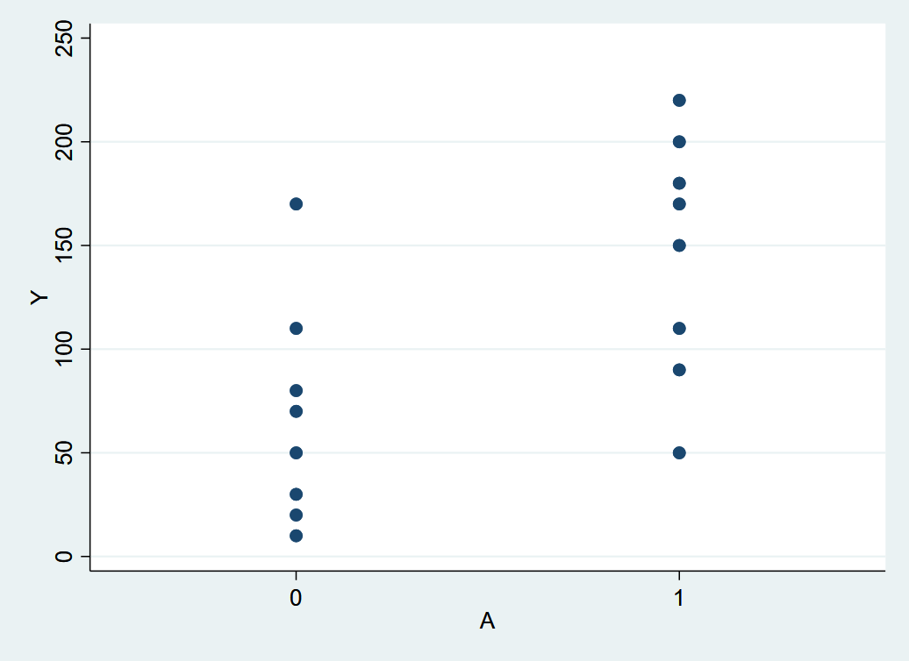
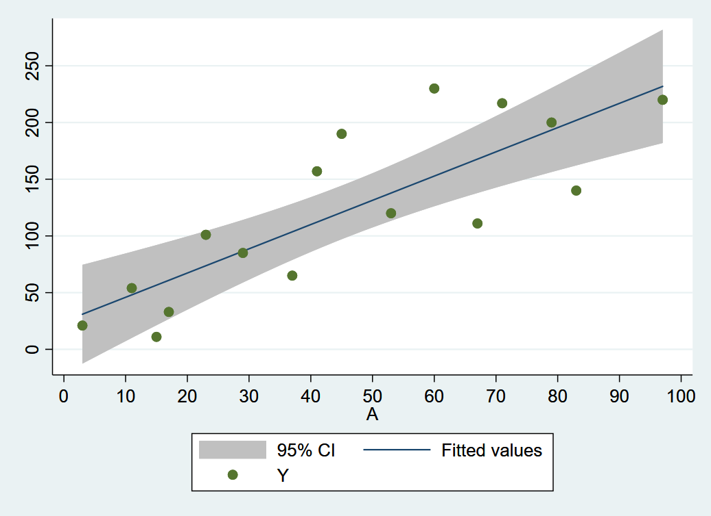

# (PART) Stata code {-}

# Why model?


```r
library(Statamarkdown)
```

```
## Stata found at C:/Program Files (x86)/Stata15/StataSE-64.exe
```

```
## The 'stata' engine is ready to use.
```

```r
switch(Sys.info()[['sysname']],
       Windows= {stataexe <- "C:/Program Files (x86)/Stata15/StataSE-64.exe"},
       Darwin = {stataexe <- "/usr/local/bin/stata-se"})
knitr::opts_chunk$set(engine.path = list(stata = stataexe))
```

## Program 11.1

- Sample averages by treatment level
- Data from Figures 11.1 and 11.2


```stata
qui input A Y
1 200
1 150
1 220
1 110
1 50
1 180
1 90
1 170
0 170
0 30
0 70
0 110
0 80
0 50
0 10
0 20
end

scatter Y A, ylab(0(50)250) xlab(0 1) xscale(range(-0.5 1.5))
qui gr export ./figs/fig11-1.png, replace

bysort A: sum Y
```

```
-> A = 0

    Variable |        Obs        Mean    Std. Dev.       Min        Max
-------------+---------------------------------------------------------
           Y |          8        67.5    53.11712         10        170

-------------------------------------------------------------------------------
-> A = 1

    Variable |        Obs        Mean    Std. Dev.       Min        Max
-------------+---------------------------------------------------------
           Y |          8      146.25     58.2942         50        220
```




```stata
qui input A Y
1 110
1 80
1 50
1 40
2 170
2 30
2 70
2 50
3 110
3 50
3 180
3 130
4 200
4 150
4 220
4 210
end

scatter Y A, ylab(0(50)250) xlab(0(1)4) xscale(range(0 4.5))
qui gr export ./figs/fig11-2.png, replace

bysort A: sum Y
```

```
-> A = 1

    Variable |        Obs        Mean    Std. Dev.       Min        Max
-------------+---------------------------------------------------------
           Y |          4          70    31.62278         40        110

-------------------------------------------------------------------------------
-> A = 2

    Variable |        Obs        Mean    Std. Dev.       Min        Max
-------------+---------------------------------------------------------
           Y |          4          80    62.18253         30        170

-------------------------------------------------------------------------------
-> A = 3

    Variable |        Obs        Mean    Std. Dev.       Min        Max
-------------+---------------------------------------------------------
           Y |          4       117.5    53.77422         50        180

-------------------------------------------------------------------------------
-> A = 4

    Variable |        Obs        Mean    Std. Dev.       Min        Max
-------------+---------------------------------------------------------
           Y |          4         195    31.09126        150        220
```


## Program 11.2

- 2-parameter linear model
- Data from Figures 11.3 and 11.1


```stata
input A Y
3   21	
11	54
17	33
23	101
29	85
37	65
41	157
53	120
67	111
79	200
83	140
97	220
60	230
71	217
15	11
45  190
end
```


```stata
* Fit the regression model
regress Y A, cformat(%5.2f)

* Output the estimated mean Y value when A = 90
lincom _b[_cons] + 90*_b[A]

* Plot the data with the regression line: Fig 11.4
twoway ///
  lfitci Y A ///
  || scatter Y A ///
  , ylab(0(50)250) xlab(0(10)100) xscale(range(0 100))
qui gr export ./figs/fig11-4.png, replace
```

```
      Source |       SS           df       MS      Number of obs   =        16
-------------+----------------------------------   F(1, 14)        =     28.59
       Model |  55582.9152         1  55582.9152   Prob > F        =    0.0001
    Residual |  27217.5223        14  1944.10873   R-squared       =    0.6713
-------------+----------------------------------   Adj R-squared   =    0.6478
       Total |  82800.4375        15  5520.02917   Root MSE        =    44.092

------------------------------------------------------------------------------
           Y |      Coef.   Std. Err.      t    P>|t|     [95% Conf. Interval]
-------------+----------------------------------------------------------------
           A |       2.14       0.40     5.35   0.000         1.28        2.99
       _cons |      24.55      21.33     1.15   0.269       -21.20       70.29
------------------------------------------------------------------------------


 ( 1)  90*A + _cons = 0

------------------------------------------------------------------------------
           Y |      Coef.   Std. Err.      t    P>|t|     [95% Conf. Interval]
-------------+----------------------------------------------------------------
         (1) |     216.89    20.8614    10.40   0.000     172.1468    261.6333
------------------------------------------------------------------------------

```



## Program 11.3

- 3-parameter linear model
- Data from Figure 11.3


```stata
* Create the product term
gen Asq = A*A

* Fit the regression model
regress Y A Asq, cformat(%5.2f)

* Output the estimated mean Y value when A = 90
lincom _b[_cons] + 90*_b[A] + 90*90*_b[Asq]

* Plot the data with the regression line: Fig 11.5
twoway ///
  qfitci Y A ///
  || scatter Y A ///
  , ylab(0(50)250) xlab(0(10)100) xscale(range(0 100))
qui gr export ./figs/fig11-5.png, replace
```

```
      Source |       SS           df       MS      Number of obs   =        16
-------------+----------------------------------   F(2, 13)        =     15.97
       Model |  58845.3712         2  29422.6856   Prob > F        =    0.0003
    Residual |  23955.0663        13  1842.69741   R-squared       =    0.7107
-------------+----------------------------------   Adj R-squared   =    0.6662
       Total |  82800.4375        15  5520.02917   Root MSE        =    42.927

------------------------------------------------------------------------------
           Y |      Coef.   Std. Err.      t    P>|t|     [95% Conf. Interval]
-------------+----------------------------------------------------------------
           A |       4.11       1.53     2.68   0.019         0.80        7.41
         Asq |      -0.02       0.02    -1.33   0.206        -0.05        0.01
       _cons |      -7.41      31.75    -0.23   0.819       -75.99       61.18
------------------------------------------------------------------------------


 ( 1)  90*A + 8100*Asq + _cons = 0

------------------------------------------------------------------------------
           Y |      Coef.   Std. Err.      t    P>|t|     [95% Conf. Interval]
-------------+----------------------------------------------------------------
         (1) |   197.1269   25.16157     7.83   0.000     142.7687    251.4852
------------------------------------------------------------------------------

```


