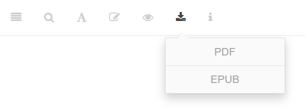
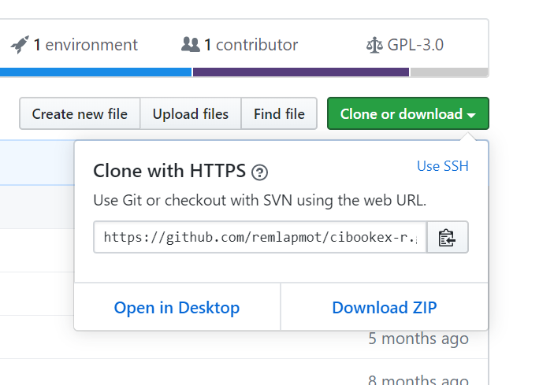

--- 
title: "Causal Inference: What If. R and Stata code for Exercises"
author: 
 - Book by M. A. Hernán and J. M. Robins
 - R code by Joy Shi and Sean McGrath
 - Stata code by Eleanor Murray and Roger Logan
 - R Markdown code by Tom Palmer
date: "`r format(Sys.Date(), '%d %B %Y')`"
site: bookdown::bookdown_site
documentclass: book
#biblio-style: apalike
link-citations: yes
description: "Code examples from Causal Inference: What If by M. A. Hernán and J. M. Robins https://www.hsph.harvard.edu/miguel-hernan/causal-inference-book/"
geometry: margin=1in
fontsize: 10pt
linestretch: 1.1
bibliography: bibliography.bib
papersize: a4
urlcolor: blue
---

```{r setup, include=FALSE}
knitr::opts_chunk$set(collapse = TRUE, comment = '#>')
```

# Preface{-}

This book presents code examples from @ci-book, which is available in draft form from the following webpage.

https://www.hsph.harvard.edu/miguel-hernan/causal-inference-book/

The R code is based on the code by Joy Shi and Sean McGrath given [here](https://cdn1.sph.harvard.edu/wp-content/uploads/sites/1268/1268/20/Rcode_CIpart2.zip).

The Stata code is based on the code by Eleanor Murray and Roger Logan given [here](https://cdn1.sph.harvard.edu/wp-content/uploads/sites/1268/2019/11/stata_part2.zip).

This repo is rendered at <https://remlapmot.github.io/cibookex-r/>. Click the download button above for the pdf and eBook versions.

```{r, echo=FALSE, out.width="65%", fig.align="center"}

```

## Downloading the code

The repo is available on GitHub [here](https://github.com/remlapmot/cibookex-r). There are a number of ways to download the code.

Either,

* click the green *Clone or download* button then choose to *Open in Desktop* or *Download ZIP*. 
    ```{r, echo=FALSE, out.width="65%", fig.align="center"}
    
    ```
    
  The *Desktop* option means open in the [GitHub Desktop](https://desktop.github.com/) app (if you have that installed on your machine). The *ZIP* option will give you a zip archive of the repo, which you then unzip.

* or fork the repo into your own GitHub account and then clone or download your forked repo to your machine.
    ```{r, echo=FALSE, out.width="65%", fig.align="center"}
    
    ```

## Installing dependency packages
It is easiest to open the repo in RStudio, as an RStudio project, by doubling click the `.Rproj` file. This makes sure that R's working directory is at the top level of the repo. If you don't want to open the repo as a project set the working directory to the top level of the repo directories using `setwd()`. Then run:
```{r eval=FALSE}
# install.packages("devtools") # uncomment if devtools not installed
devtools::install_dev_deps()
```

## Downloading the datasets
We assume that you have downloaded the data from the Causal Inference Book website and saved it to a `data` subdirectory. You can do this manually or with the following code (nb. we use the [`here`](https://here.r-lib.org/) package to reference the data subdirectory).

```{r, results='hide', message=FALSE, warning=FALSE}
library(here)
```

```{r}
dataurls <- list()
stub <- "https://cdn1.sph.harvard.edu/wp-content/uploads/sites/1268/"
dataurls[[1]] <- paste0(stub, "2012/10/nhefs_sas.zip")
dataurls[[2]] <- paste0(stub, "2012/10/nhefs_stata.zip")
dataurls[[3]] <- paste0(stub, "2017/01/nhefs_excel.zip")
dataurls[[4]] <- paste0(stub, "1268/20/nhefs.csv")

temp <- tempfile()
for (i in 1:3) {
  download.file(dataurls[[i]], temp)
  unzip(temp, exdir = "data")
}

download.file(dataurls[[4]], here("data", "nhefs.csv"))
```

\mainmatter
